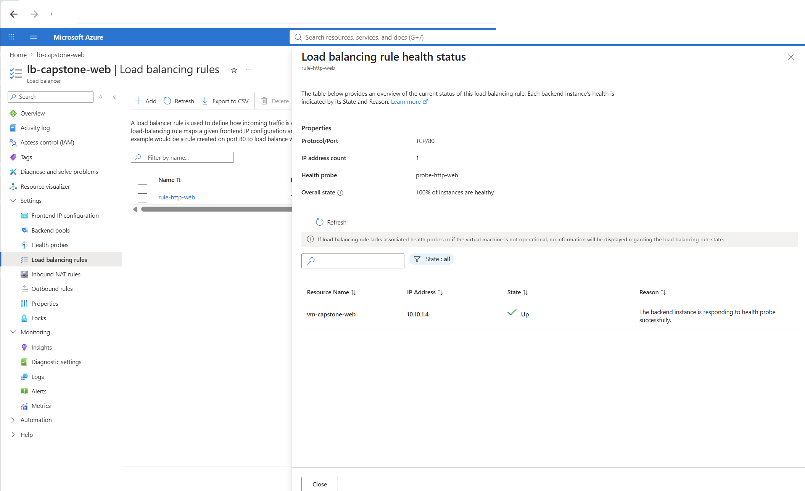
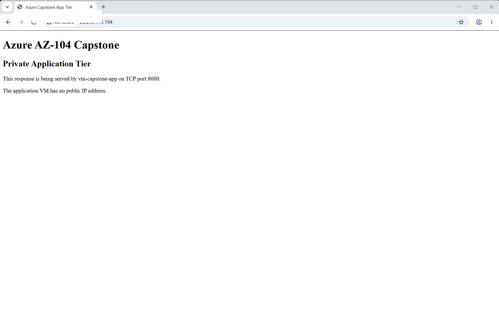
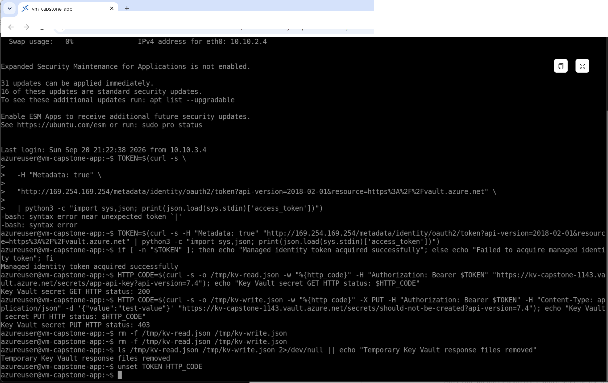
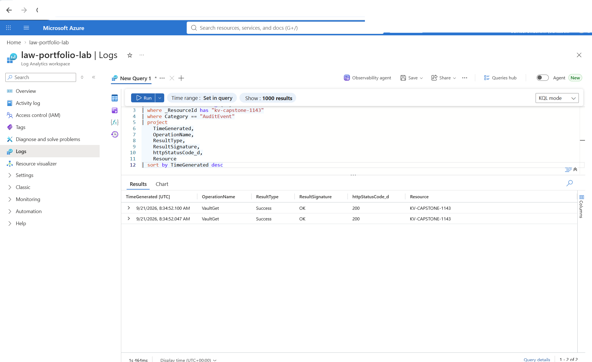
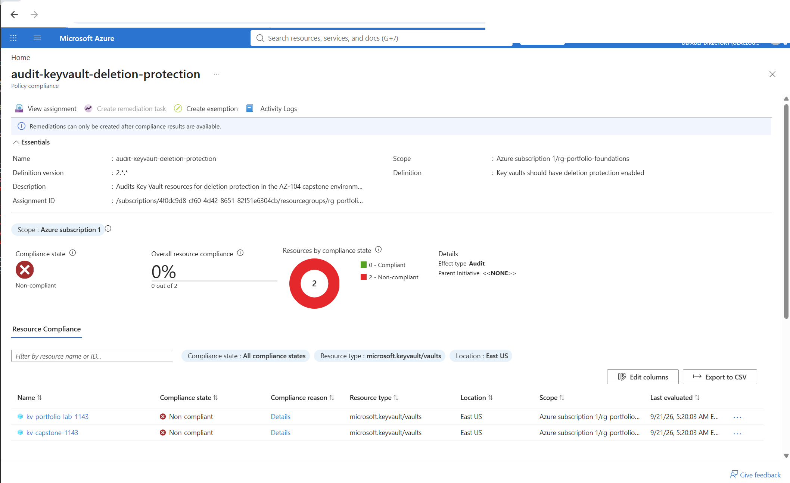
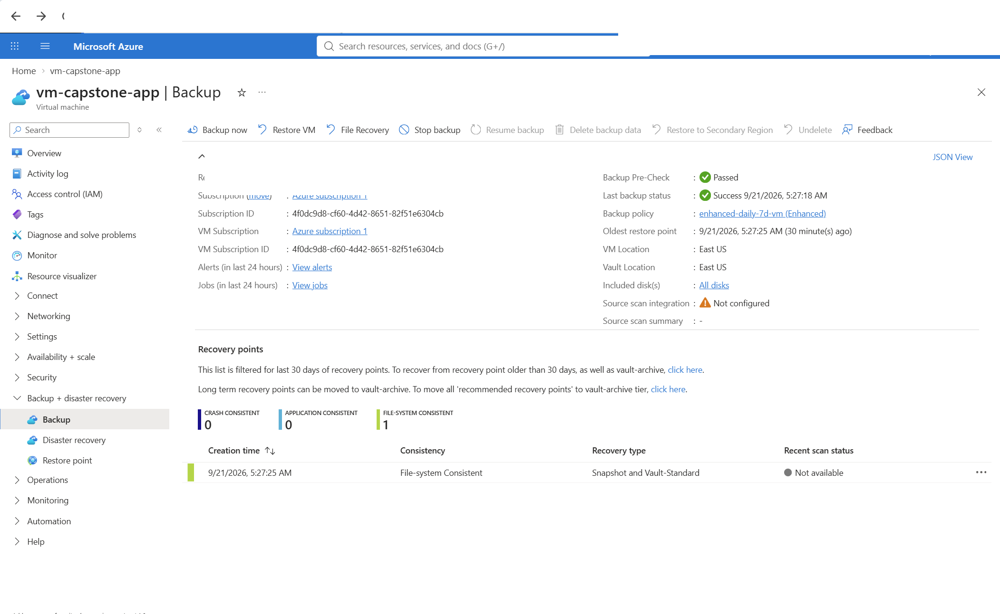
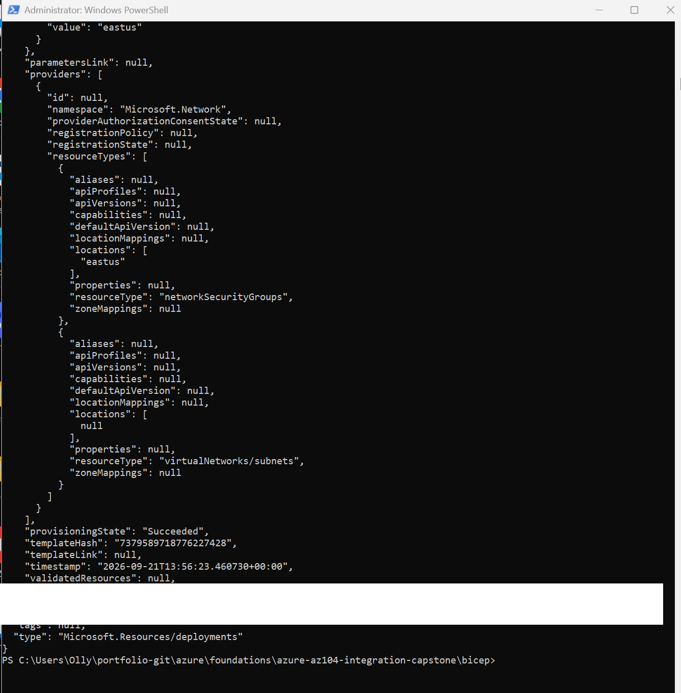

# Azure AZ-104 Integration Capstone

## Secure Two-Tier Application Environment

This project brings together the main Azure administration skills I practiced throughout my AZ-104 lab series into one integrated environment.

The goal was to design and validate a small production-style Azure environment for a web application with a public entry point, private application tier, controlled administrative access, passwordless access to secrets, centralized monitoring, governance, backup and recovery, and Infrastructure as Code.

Instead of focusing on one Azure service, this capstone required the services to work together as one system.

---

## Architecture

```text
                         Internet
                            |
                            v
                 Azure Standard Load Balancer
                            |
                         TCP 80
                            |
                            v
                   vm-capstone-web
                    Private Web Tier
                     10.10.1.0/24
                            |
                     Nginx Reverse Proxy
                            |
                         TCP 8080
                            |
                            v
                   vm-capstone-app
                 Private Application Tier
                     10.10.2.0/24
                            |
             +--------------+--------------+
             |                             |
             v                             v
      Managed Identity              Azure Monitor
             |                      / Log Analytics
             v
        Microsoft Entra ID
             |
             v
      Azure Key Vault
      RBAC-protected secrets

Administrative access:
Internet -> Azure Bastion -> Private VMs

Outbound access:
Private subnets -> NAT Gateway -> Internet

Governance:
Azure Policy -> Resource Group -> Compliance Evaluation

Recovery:
vm-capstone-app -> Recovery Services Vault
```

---

## What I Built

The capstone environment included:

- Dedicated Azure virtual network
- Separate web and application subnets
- Private Linux virtual machines
- Network Security Groups
- Azure Standard Load Balancer
- Nginx reverse proxy
- Azure Bastion
- NAT Gateway
- System-assigned managed identity
- Microsoft Entra ID authentication
- Azure Key Vault
- Azure RBAC
- Log Analytics
- Key Vault diagnostic logging
- Azure Policy
- Recovery Services vault backup
- Bicep Infrastructure as Code
- Azure deployment What-If validation
- Cost-aware resource cleanup

The application VMs were intentionally deployed without public IP addresses.

---

## Network Design

The environment used the following address space:

| Component | Address |
|---|---|
| Virtual network | `10.10.0.0/16` |
| Web subnet | `10.10.1.0/24` |
| Application subnet | `10.10.2.0/24` |
| Azure Bastion subnet | `10.10.3.0/26` |

The web and application tiers were separated so that each tier could have its own security controls.

The application VM remained private and was not directly reachable from the Internet.

---

## Network Security

Two subnet-level NSGs were used.

### Web Tier

The web tier permits HTTP traffic on TCP 80.

```text
Internet
   |
 TCP 80
   |
   v
Web Tier
```

### Application Tier

The application NSG was more restrictive.

```text
Web subnet      -> App TCP 8080     Allow
Bastion subnet  -> App TCP 22       Allow
Other VNet      -> App              Deny
```

One thing I wanted to verify was that the web tier could reach the application service without also gaining administrative access to the application VM.

From the web VM:

```text
HTTP to app:8080  -> Successful
SSH to app:22     -> Timed out
```

This confirmed that application traffic was allowed while unnecessary administrative access between tiers remained blocked.

---

## Private Compute

Two Ubuntu Server virtual machines were deployed:

### Web VM

`vm-capstone-web`

- Ubuntu Server 24.04 LTS
- Zone 1
- Trusted Launch
- Secure Boot
- vTPM
- No public IP
- System-assigned managed identity
- Nginx

### Application VM

`vm-capstone-app`

- Ubuntu Server 24.04 LTS
- Zone 2
- Trusted Launch
- Secure Boot
- vTPM
- No public IP
- System-assigned managed identity
- Nginx application service on TCP 8080

Using separate availability zones also gave the two tiers some physical infrastructure separation.

---

## Public Application Path

The public application path was:

```text
Internet
   |
   v
Azure Load Balancer :80
   |
   v
vm-capstone-web :80
   |
   v
Nginx Reverse Proxy
   |
   v
vm-capstone-app :8080
```

The Load Balancer backend health reached 100%, confirming that the private web VM was healthy.



The final browser validation confirmed that traffic successfully traveled through the entire architecture and reached the private application tier.



Neither application VM required a public IP.

---

## Secure Administration with Azure Bastion

Azure Bastion was used for browser-based SSH access to the private virtual machines.

This allowed administrative access without assigning public IP addresses to the VMs.

During deployment, the Azure Portal initially selected a newly generated VNet instead of the existing capstone VNet. I caught this during review and changed the configuration back to:

```text
vnet-az104-capstone
AzureBastionSubnet
```

This reinforced the importance of reviewing Azure Portal defaults before deployment.

Bastion was later deleted when it was no longer needed to avoid unnecessary hourly charges.

---

## Controlled Outbound Internet Access

The web and application subnets were configured as private subnets without default outbound access.

A NAT Gateway provided controlled outbound connectivity.

```text
snet-web ----+
             |
             +--> NAT Gateway --> Internet
             |
snet-app ----+
```

Outbound connectivity was tested successfully from both VMs.

The application VM was also able to perform package updates while remaining without a public IP.

The NAT Gateway was removed after testing to avoid ongoing cost.

---

## Managed Identity and Key Vault

The application VM used a system-assigned managed identity for passwordless authentication to Azure.

The authentication path was:

```text
vm-capstone-app
       |
       v
System-Assigned Managed Identity
       |
       v
Microsoft Entra ID
       |
       v
Azure RBAC
       |
       v
Azure Key Vault
```

The application identity received:

```text
Key Vault Secrets User
```

at the Key Vault scope.

The web VM was not granted Key Vault access.

The Key Vault network configuration allowed the application subnet while avoiding broad public access.

---

## Least-Privilege Validation

I tested both an allowed operation and a denied operation from `vm-capstone-app`.

The VM successfully obtained a managed identity token and attempted two Key Vault operations:

```text
GET secret  -> HTTP 200
PUT secret  -> HTTP 403
```

The successful GET proved that the application could retrieve the required secret.

The denied PUT proved that the identity could not create or modify secrets.



This was an important validation because a successful connection alone would not prove least privilege.

No credentials, passwords, secret values, or authentication tokens were stored in the repository.

---

## Monitoring and Log Analytics

The capstone reused the existing Log Analytics workspace:

```text
law-portfolio-lab
```

Key Vault diagnostic settings sent audit events and metrics to Log Analytics.

The diagnostic setting included:

```text
AuditEvent
AllMetrics
```

I generated a fresh Key Vault request from the application VM and verified that the event reached Log Analytics.

The query returned successful Key Vault operations with HTTP status 200.



### Monitoring Troubleshooting

The initial query returned no capstone Key Vault events.

Instead of assuming diagnostics were broken, I worked through the path:

```text
Verify workspace ingestion
        |
        v
Remove narrow query filters
        |
        v
Verify diagnostic setting
on the correct Key Vault
        |
        v
Generate a fresh Key Vault request
        |
        v
Query Log Analytics again
```

After generating a fresh event, the Key Vault audit records appeared successfully.

This was a useful reminder that troubleshooting monitoring requires checking both the telemetry source and the destination.

---

## Azure Policy Governance

Azure Policy was used to evaluate Key Vault deletion protection.

The policy assignment was scoped to:

```text
rg-portfolio-foundations
```

Policy:

```text
Key vaults should have deletion protection enabled
```

The capstone Key Vault had soft delete enabled but purge protection disabled.

After triggering a compliance scan, Azure Policy identified the Key Vault as non-compliant.



I intentionally kept the finding rather than enabling purge protection only to make the dashboard green.

For this temporary lab environment, enabling purge protection would affect the deletion lifecycle for the configured retention period. In a production environment where deletion protection is required, the control should be enabled according to the organization's governance requirements.

The exercise demonstrated that governance is not only about assigning a policy. The result must be evaluated and an engineering decision made about the finding.

---

## Backup and Recovery

The private application VM was protected using Azure Backup.

Configuration:

```text
VM:                vm-capstone-app
Recovery vault:    rsv-portfolio-lab
Policy:            enhanced-daily-7d-vm
Policy type:       Enhanced
Protected disks:   All disks
```

The backup pre-check passed and an on-demand backup was performed.

Azure successfully created a recovery point.



A full file-recovery exercise was already performed in my earlier VM operations and recovery project, so this capstone focused on integrating backup protection into the larger architecture rather than repeating the same recovery workflow.

---

## Infrastructure as Code with Bicep

The network and security foundation was represented using Bicep.

The template includes:

- Existing capstone VNet reference
- Existing NAT Gateway reference
- Web NSG
- Application NSG
- Web subnet configuration
- Application subnet configuration
- Bastion subnet configuration
- NAT Gateway subnet associations
- Key Vault service endpoint
- Private subnet configuration

Bicep source:

[`bicep/main.bicep`](bicep/main.bicep)

---

## Bicep Safety Validation

I did not deploy the first version of the template immediately.

The initial Azure What-If identified that the template would remove existing subnet configuration, including:

- NAT Gateway associations
- Key Vault service endpoint
- Existing subnet properties

Deploying that version could have broken the working environment.

I changed the template to reference the existing shared networking resources and explicitly preserve the required subnet configuration.

The second What-If returned:

```text
5 no change
45 to ignore
0 modify
0 create
0 delete
```

Only after the destructive changes disappeared did I deploy the template.

The deployment completed successfully:

```text
provisioningState: Succeeded
```



I also tested bringing the NAT Gateway under direct Bicep management. What-If exposed differences between live StandardV2 NAT Gateway properties and the properties supported by the Bicep resource type. Rather than force a modification to a working resource, I kept the NAT Gateway as an existing dependency.

That decision kept the final template conservative and avoided changing infrastructure simply to make the IaC file broader.

---

## Final Validation

After the Bicep deployment, both application VMs were started again and the public application endpoint was tested.

The complete path still worked:

```text
Internet
   |
   v
Load Balancer
   |
   v
Private Web VM
   |
   v
Reverse Proxy
   |
   v
Private Application VM
```

This confirmed that the Infrastructure as Code deployment had not broken the working network architecture.

---

## Cost Management

Cost management was treated as part of the lab rather than an afterthought.

During the project:

- VM auto-shutdown was configured.
- VMs were deallocated when not being used.
- Bastion was deleted when administrative access was no longer required.
- NAT Gateway was removed after outbound testing was complete.
- Load Balancer and its public IP were removed after final validation.
- Temporary public IP resources were deleted when no longer needed.

The remaining lab resources can also be removed after the portfolio documentation is complete because the architecture and evidence are preserved in GitHub.

---

## Troubleshooting Highlights

Several issues required investigation during this project.

### Azure Portal Changed VM Networking

Going backward through the VM creation wizard caused Azure to repopulate a public IP selection.

I caught the change during final review and reset the VM to:

```text
Public IP: None
```

This reinforced the importance of reviewing the final configuration before deployment.

### Bastion Selected the Wrong VNet

During Bastion deployment, the Portal initially selected a newly generated VNet instead of the existing capstone network.

The configuration was corrected before deployment.

### HTTPS Test Failed

The first public endpoint test used HTTPS and timed out.

The Load Balancer was configured only for:

```text
HTTP / TCP 80
```

Testing with HTTP succeeded.

### Key Vault Logs Initially Missing

The first Log Analytics query returned no capstone Key Vault events.

I verified the diagnostic configuration, generated fresh Key Vault activity, and confirmed successful ingestion.

### Unsafe Bicep What-If

The first Bicep What-If predicted removal of working subnet configuration.

Instead of deploying it, I corrected the template and repeated What-If until there were no destructive changes.

This was one of the most useful parts of the capstone because it showed why Infrastructure as Code still requires careful review.

---

## Security Decisions

The final design applied several security principles:

- No public IP addresses on application VMs
- Network segmentation between web and application tiers
- Explicit application-port access
- Restricted administrative SSH access
- Azure Bastion for private administration
- System-assigned managed identity
- Passwordless Azure authentication
- Least-privilege Key Vault RBAC
- Key Vault network restrictions
- Centralized audit logging
- Azure Policy governance
- Trusted Launch
- Secure Boot
- vTPM
- Backup protection
- No secrets or credentials stored in GitHub

---

## What I Learned

This capstone helped connect the individual Azure services I had practiced in earlier projects.

The biggest difference was that changing one part of the environment could affect several other services.

Networking affected Key Vault access. Private subnets affected outbound connectivity. NSG rules affected application communication. Identity permissions determined what the application could do. Diagnostic settings determined whether security activity could be investigated.

I also learned not to treat a successful deployment as the only definition of success.

The environment had to be:

- reachable where required
- private where required
- least privileged
- observable
- governed
- recoverable
- reproducible
- cost conscious

The Bicep work reinforced this most clearly. What-If identified changes that could have damaged a working environment, so I corrected the template before deployment instead of treating Infrastructure as Code as automatically safe.

---

## Skills Demonstrated

- Azure virtual networking
- Subnet design
- Network Security Groups
- Azure Load Balancer
- NAT Gateway
- Azure Bastion
- Linux administration
- Nginx reverse proxy
- Azure virtual machines
- Availability zones
- Managed identities
- Microsoft Entra ID
- Azure RBAC
- Azure Key Vault
- Azure Monitor
- Log Analytics
- KQL
- Diagnostic settings
- Azure Policy
- Azure Backup
- Recovery Services vaults
- Bicep
- Azure CLI
- Deployment What-If
- Troubleshooting
- Least-privilege design
- Cost-aware cloud administration

---

## Repository Structure

```text
azure-az104-integration-capstone/
├── README.md
├── bicep/
│   └── main.bicep
└── screenshots/
    ├── 01-public-application-validation.png
    ├── 02-load-balancer-health.png
    ├── 03-keyvault-managed-identity-least-privilege.png
    ├── 04-keyvault-log-analytics.png
    ├── 05-azure-policy-compliance.png
    ├── 06-vm-backup-recovery-point.png
    └── 07-bicep-deployment-success.png
```

---

## Related Azure Projects

This capstone builds on the Azure foundation projects in this portfolio, including:

- Azure Blob Storage + Microsoft Entra ID + RBAC
- Secure Two-Tier Network Architecture
- Azure Key Vault + Managed Identity
- Azure VM Operations, Monitoring & Recovery
- Azure High Availability & Resiliency
- Azure Windows & Enterprise Administration

Together, these projects form the hands-on foundation of my AZ-104 preparation and my broader path toward cloud engineering, architecture, security, and automation.
