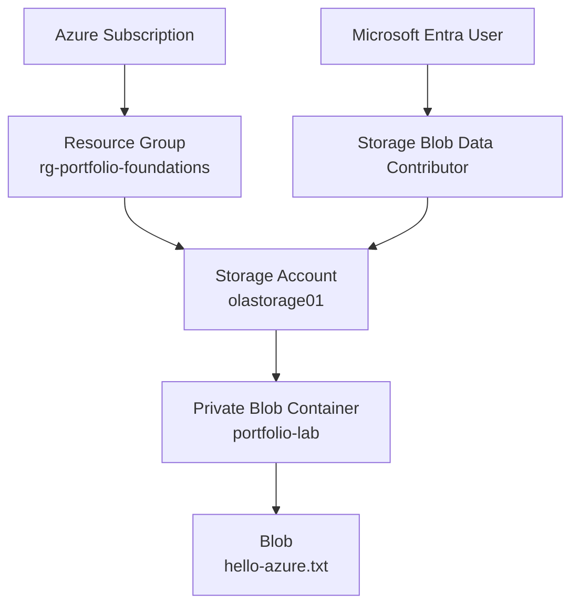

# Azure Blob Storage with RBAC and Microsoft Entra ID

## Project Overview

This project documents my hands-on experience with Azure Blob Storage, Microsoft Entra ID, and Azure RBAC.

The goal was to create an Azure Storage account, create a private Blob container, and securely access the Blob using Microsoft Entra ID and Azure RBAC.

I also wanted to understand the difference between having permission to manage an Azure resource and having permission to access the actual data stored inside it.

**Status:** Completed

---

## Objective

For this lab, I wanted to:

* Create a resource group and storage account.
* Create a private Blob container.
* Configure basic storage security settings.
* Use Microsoft Entra ID for authentication.
* Use Azure RBAC to control access to Blob data.
* Upload a test file and confirm that I could access it.
* Document what I learned from the process.

---

## Architecture



The resource structure for the lab was:

```text
Azure Subscription
└── rg-portfolio-foundations
    └── olastorage01
        └── portfolio-lab
            └── hello-azure.txt
```

---

## Azure Services Used

| Service               | Purpose                                    |
| --------------------- | ------------------------------------------ |
| Azure Resource Group  | Organized the resources for the lab        |
| Azure Storage Account | Hosted the storage service                 |
| Azure Blob Storage    | Stored the test file                       |
| Microsoft Entra ID    | Provided user authentication               |
| Azure RBAC            | Controlled access to Blob data             |
| Azure Portal          | Used to configure and manage the resources |
| Azure Storage Browser | Used to test access to the Blob            |

---

## Storage Configuration

I created a StorageV2 account with the following settings:

| Setting                       | Configuration    |
| ----------------------------- | ---------------- |
| Performance                   | Standard         |
| Replication                   | LRS              |
| Location                      | East US          |
| Access tier                   | Hot              |
| Secure transfer               | Enabled          |
| Minimum TLS                   | 1.2              |
| Blob anonymous access         | Disabled         |
| Microsoft Entra authorization | Enabled          |
| Blob soft delete              | Enabled - 7 days |
| Container soft delete         | Enabled - 7 days |
| Public network access         | Enabled          |

I used Standard performance and LRS because this is a small learning environment and does not need the additional cost or redundancy of a production workload.

The Hot access tier was also suitable because the test Blob was being actively accessed during the lab.

---

## Security Configuration

I kept the Blob container private and disabled anonymous Blob access.

Instead of allowing public access to the data, I used my Microsoft Entra identity together with Azure RBAC.

Secure transfer was enabled and the minimum TLS version was set to 1.2.

I also enabled Blob and container soft delete for 7 days. This provides a short recovery period if a Blob or container is accidentally deleted.

### Public Network Access

Public network access was enabled for this lab.

I left this enabled because my main goal for this lab was to learn Blob Storage, Microsoft Entra authentication, and RBAC without adding private networking yet.

The container itself was still private. Anonymous Blob access was disabled, so accessing the data required authentication and the correct permissions.

In a later project, I can improve this by testing storage firewall rules, network restrictions, and Private Endpoints.

---

## RBAC Configuration

To access the Blob data, I assigned:

**Role:** `Storage Blob Data Contributor`

**Assigned to:** Microsoft Entra user

**Scope:** `olastorage01` storage account

This role gave my user the Blob data permissions needed for the lab.

I assigned the role at the storage account level. For a larger environment, I would also consider whether the role could be assigned at a narrower scope based on what the user actually needs to access.

---

## Authentication

Blob access was tested using:

**Microsoft Entra ID authentication**

I did not use anonymous access for the container.

I also did not use storage account keys, connection strings, or SAS tokens for the access method demonstrated in this lab.

---

## Implementation

### 1. Created the resource group

Created:

`rg-portfolio-foundations`

I used a separate resource group so the resources for this lab could be kept together and easily identified.

### 2. Created the storage account

Created:

`olastorage01`

I configured the storage and security settings listed above.

### 3. Created the Blob container

Created:

`portfolio-lab`

The container was configured as private.

### 4. Configured RBAC

I assigned my Microsoft Entra user the:

`Storage Blob Data Contributor`

role at the storage account scope.

### 5. Uploaded a test file

I uploaded:

`hello-azure.txt`

to the `portfolio-lab` container.

### 6. Tested access

I used Azure Storage Browser with Microsoft Entra authentication and confirmed that I could access the Blob.

---

## Validation

I confirmed that:

* The resource group and storage account were created successfully.
* The `portfolio-lab` container was private.
* My Microsoft Entra user had the `Storage Blob Data Contributor` role.
* `hello-azure.txt` uploaded successfully.
* I could access the Blob using Microsoft Entra authentication.

This confirmed that the RBAC permissions were working for Blob data access.

---

## Evidence

Screenshots for this project are stored in the `screenshots` folder.

| Screenshot                         | Shows                                            |
| ---------------------------------- | ------------------------------------------------ |
| `01-rbac-role-assignment.png`      | Storage Blob Data Contributor assignment         |
| `02-storage-security.png`          | Storage account security settings                |
| `03-private-container.png`         | Private Blob container                           |
| `04-authenticated-blob-access.png` | Blob access using Microsoft Entra authentication |
| `05-hello-azure.png`               | Uploaded `hello-azure.txt`                       |
| `06-resource-hierarchy.png`        | Azure resource organization                      |

---

## Security Considerations

Before publishing the screenshots, I reviewed them to make sure they do not expose sensitive information such as:

* Subscription ID
* Tenant ID
* Object ID
* Email or account identifiers
* Storage account access keys
* Connection strings
* SAS tokens
* Access tokens
* Passwords or secrets

Only screenshots that are safe for a public repository should be included.

---

## Cost Considerations

This lab was designed to stay small and inexpensive.

I used Standard storage with LRS and stored only a very small test file. There were no virtual machines or other compute resources running as part of this project.

For future Azure projects, I will continue checking resource pricing and removing resources that are no longer needed.

---

## What I Learned

The biggest lesson from this lab was the difference between **management-plane permissions** and **data-plane permissions**.

At first, it is easy to assume that if a user can manage a storage account, that user should also be able to access the files inside it.

Azure separates these permissions.

```text
Management Plane
      ↓
Manage the Storage Account


Data Plane
      ↓
Access Containers and Blobs
```

To access the Blob data through Microsoft Entra ID, my user needed the appropriate Blob data role.

For this lab, that role was:

`Storage Blob Data Contributor`

I also gained hands-on experience with private containers, Microsoft Entra authentication, RBAC, storage security settings, and soft delete.

---

## Lessons Learned

A few things stood out while completing this lab:

**1. Managing a resource does not automatically give access to its data.**

Azure separates resource management permissions from Blob data permissions.

**2. Authentication and authorization work together.**

Microsoft Entra ID identifies the user, while Azure RBAC determines what that user is allowed to do.

**3. Small labs can still use good security practices.**

Even though this was only a learning environment, I disabled anonymous Blob access, enabled secure transfer, used TLS 1.2, and enabled soft delete.

**4. Not every security feature needs to be added in a foundational lab.**

I intentionally left public network access enabled so I could focus on storage, identity, and RBAC first. Private networking can be added in a future lab.

---

## Future Improvements

As I continue learning Azure, I can build on this project by adding:

* Storage firewall rules
* Private Endpoints
* Azure Private Link
* Private DNS
* More granular RBAC assignments
* Azure Monitor and diagnostic logs
* Azure Policy
* Terraform deployment
* Automated configuration and validation

---

## Technologies

* Microsoft Azure
* Azure Blob Storage
* Microsoft Entra ID
* Azure RBAC
* Azure Resource Groups
* Azure Portal
* Azure Storage Browser
* GitHub
* Markdown

---

## Project Status

**Completed**

This project is part of my hands-on Azure experience and demonstrates practical work with Azure Storage, Microsoft Entra ID, RBAC, and secure Blob access.
