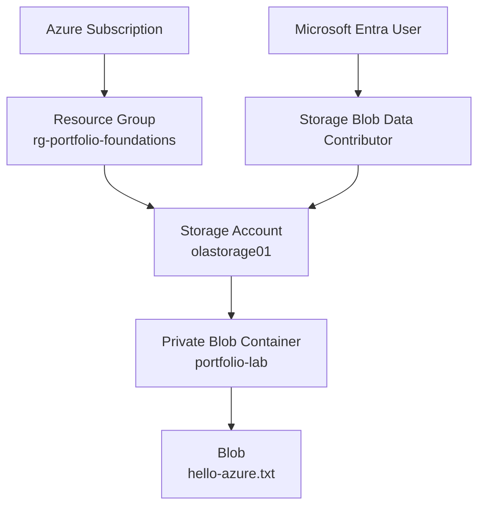

# Azure Blob Storage with RBAC and Microsoft Entra ID

## Project Overview

This project was my first hands-on Azure portfolio lab and focused on Azure Blob Storage, Microsoft Entra ID, and Azure RBAC.

The goal was to create a private Blob container and securely access the data using Microsoft Entra authentication and role-based access control.

A key part of the lab was understanding the difference between having permission to manage an Azure resource and having permission to access the data stored inside it.

**Status:** Completed

---

## Objective

The main objectives were to:

* Create a resource group and storage account
* Create a private Blob container
* Configure basic storage security
* Use Microsoft Entra ID for authentication
* Use Azure RBAC to control Blob data access
* Upload and access a test file
* Understand management-plane and data-plane permissions
* Document and validate the configuration

---

## Architecture



The resource structure for the lab was:

```text
Azure Subscription
└── rg-portfolio-foundations
    └── olastorage01
        └── portfolio-lab
            └── hello-azure.txt
```

### Azure Resource Hierarchy

The storage account was organized inside the `rg-portfolio-foundations` resource group.


---

## Azure Services Used

| Service | Purpose |
| --- | --- |
| Azure Resource Group | Organized the lab resources |
| Azure Storage Account | Hosted the storage service |
| Azure Blob Storage | Stored the test file |
| Microsoft Entra ID | Provided user authentication |
| Azure RBAC | Controlled access to Blob data |
| Azure Portal | Used to configure and manage the resources |
| Azure Storage Browser | Used to test Blob access |

---

## Storage Configuration

The StorageV2 account used the following settings:

| Setting | Configuration |
| --- | --- |
| Performance | Standard |
| Replication | LRS |
| Location | East US |
| Access tier | Hot |
| Secure transfer | Enabled |
| Minimum TLS | 1.2 |
| Blob anonymous access | Disabled |
| Microsoft Entra authorization | Enabled |
| Blob soft delete | Enabled - 7 days |
| Container soft delete | Enabled - 7 days |
| Public network access | Enabled |

Standard performance and LRS were enough for this lab because it was a small learning environment and did not require production-level redundancy.

The Hot access tier was suitable because the test Blob was actively accessed during the lab.

### Storage Security Settings

Secure transfer was enabled, the minimum TLS version was set to 1.2, and anonymous Blob access was disabled.


---

## Security Configuration

The Blob container was kept private and anonymous Blob access was disabled.

Access to the data was handled through Microsoft Entra ID and Azure RBAC instead of making the container public.

Blob and container soft delete were also enabled for 7 days to provide a short recovery period if data was deleted by mistake.

### Public Network Access

Public network access was intentionally left enabled.

The main focus of this first lab was storage, identity, and RBAC. Adding private networking at the same time would have introduced another layer before the basic access model was understood.

The container itself remained private, so public network access did not mean anonymous access to the Blob data. Authentication and the correct permissions were still required.

More restrictive networking is covered in later Azure projects.

---

## RBAC Configuration

Blob data access was provided using:

**Role:** `Storage Blob Data Contributor`

**Assigned to:** Microsoft Entra user

**Scope:** `olastorage01` storage account

The role provides the data permissions needed to work with Blobs.

For this lab, the role was assigned at the storage account level. In a larger environment, a narrower scope could be used when appropriate to reduce unnecessary access.

### RBAC Role Assignment

The screenshot below shows the `Storage Blob Data Contributor` role assignment.


---

## Authentication

Blob access was tested using **Microsoft Entra ID authentication**.

The demonstrated access method did not use:

* Anonymous access
* Storage account keys
* Connection strings
* SAS tokens

This allowed the Blob to remain private while access was tied to an authenticated Azure identity.

### Authenticated Blob Access

The private container was successfully accessed using Microsoft Entra authentication.


---

## Implementation

### 1. Resource Group

Created:

`rg-portfolio-foundations`

This keeps the Azure portfolio resources organized in one resource group.

### 2. Storage Account

Created:

`olastorage01`

The storage and security settings listed above were then configured.

### 3. Private Blob Container

Created:

`portfolio-lab`

Anonymous access was disabled.


### 4. RBAC

The Microsoft Entra user was assigned:

`Storage Blob Data Contributor`

at the storage account scope.

### 5. Test File

Uploaded:

`hello-azure.txt`

to the `portfolio-lab` container.

### 6. Access Test

Azure Storage Browser was used with Microsoft Entra authentication to test access.

The `hello-azure.txt` Blob was successfully available inside the private container.


---

## Validation

The final configuration was checked to confirm:

* The storage account was created successfully
* The `portfolio-lab` container was private
* Anonymous Blob access was disabled
* The Microsoft Entra user had the `Storage Blob Data Contributor` role
* `hello-azure.txt` uploaded successfully
* The Blob could be accessed using Microsoft Entra authentication

The successful access test confirmed that the Blob data RBAC permissions were working.

---

## Evidence

Screenshots from the implementation and validation are stored in the `images` folder.

| Screenshot | Shows |
| --- | --- |
| `01-rbac-role-assignment.png` | Storage Blob Data Contributor assignment |
| `02-storage-security.png` | Storage account security settings |
| `03-private-container.png` | Private Blob container |
| `04-authenticated-blob-access.png` | Blob access using Microsoft Entra authentication |
| `05-hello-azure.png` | Uploaded `hello-azure.txt` |
| `06-resource-hierarchy.png` | Azure resource organization |

---

## Security Considerations

Before publishing the screenshots, sensitive or unnecessary account information was removed.

This included:

* Subscription ID
* Tenant ID
* Object ID
* Email or account identifiers
* Storage account access keys
* Connection strings
* SAS tokens
* Access tokens
* Passwords or secrets

Only sanitized screenshots are included in the public repository.

---

## Cost Considerations

This lab was kept small and inexpensive.

Standard storage with LRS was used, and only a small test file was stored. There were no virtual machines or other compute resources running as part of the project.

This kept the focus on learning the storage and access-control concepts without adding unnecessary Azure costs.

---

## What I Learned

The biggest lesson from this lab was the difference between **management-plane permissions** and **data-plane permissions**.

Being able to manage a storage account does not automatically mean a user can access the files stored inside it.

Azure separates the two:

```text
Management Plane
      ↓
Manage the Storage Account


Data Plane
      ↓
Access Containers and Blobs
```

Microsoft Entra ID handles authentication, while Azure RBAC determines what the authenticated identity is allowed to do.

For Blob data access in this lab, the required role was:

`Storage Blob Data Contributor`

This lab also helped me understand why cloud security is easier to learn in layers. I focused first on storage, identity, and RBAC instead of trying to add every security feature at once.

That foundation made the networking and identity controls in my later Azure labs easier to understand.

---

## Future Improvements

This project can be extended with:

* Storage firewall rules
* Private Endpoints
* Azure Private Link
* Private DNS
* More granular RBAC assignments
* Azure Monitor and diagnostic logs
* Azure Policy
* Infrastructure as Code
* Automated configuration and validation

Some of these controls are introduced in later projects as the portfolio progresses from basic Azure services to networking, workload identity, monitoring, and governance.

---

## Technologies

* Microsoft Azure
* Azure Blob Storage
* Microsoft Entra ID
* Azure RBAC
* Azure Resource Groups
* Azure Portal
* Azure Storage Browser
* GitHub
* Markdown

---

## Project Status

**Completed**

This project provided the foundation for my later Azure labs by introducing storage, identity, RBAC, private Blob access, security configuration, and validation.
