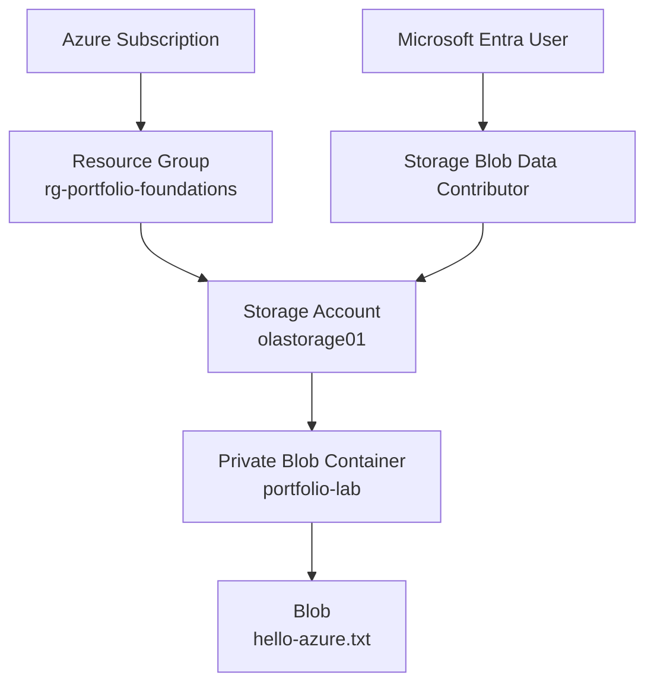

# Azure Blob Storage with RBAC and Microsoft Entra ID

## Project Overview

This was my first hands-on Azure portfolio lab.

I wanted to learn how Azure Blob Storage works and, more importantly, understand how Microsoft Entra ID and Azure RBAC control access to data.

For this lab, I created an Azure Storage account, created a private Blob container, uploaded a test file, and used my Microsoft Entra identity to access the file.

One of the main things I wanted to understand was the difference between being able to manage an Azure resource and being able to access the data stored inside it.

**Status:** Completed

---

## Objective

For this lab, I wanted to:

* Create a resource group and storage account
* Create a private Blob container
* Configure basic storage security settings
* Use Microsoft Entra ID for authentication
* Use Azure RBAC to control access to Blob data
* Upload a test file and confirm that I could access it
* Understand the difference between management-plane and data-plane permissions
* Document what I learned

---

## Architecture



The resource structure for the lab was:

```text
Azure Subscription
└── rg-portfolio-foundations
    └── olastorage01
        └── portfolio-lab
            └── hello-azure.txt
```

### Azure Resource Hierarchy

The Azure portal shows the storage account inside the `rg-portfolio-foundations` resource group.


---

## Azure Services Used

| Service | Purpose |
| --- | --- |
| Azure Resource Group | Kept the lab resources organized |
| Azure Storage Account | Hosted the storage service |
| Azure Blob Storage | Stored the test file |
| Microsoft Entra ID | Authenticated my user account |
| Azure RBAC | Controlled access to the Blob data |
| Azure Portal | Used to configure and manage the resources |
| Azure Storage Browser | Used to test access to the Blob |

---

## Storage Configuration

I created a StorageV2 account with the following settings:

| Setting | Configuration |
| --- | --- |
| Performance | Standard |
| Replication | LRS |
| Location | East US |
| Access tier | Hot |
| Secure transfer | Enabled |
| Minimum TLS | 1.2 |
| Blob anonymous access | Disabled |
| Microsoft Entra authorization | Enabled |
| Blob soft delete | Enabled - 7 days |
| Container soft delete | Enabled - 7 days |
| Public network access | Enabled |

I chose Standard performance and LRS because this was a small learning lab. I did not need the extra cost or redundancy of a production storage environment.

I also used the Hot access tier because I was actively accessing the test Blob during the lab.

### Storage Security Settings

I enabled secure transfer, set the minimum TLS version to 1.2, disabled anonymous Blob access, and used Microsoft Entra authorization.


---

## Security Configuration

I kept the Blob container private and disabled anonymous Blob access.

Instead of making the data publicly available, I used my Microsoft Entra identity together with Azure RBAC.

I also enabled Blob and container soft delete for 7 days. This gives a short recovery period if a Blob or container is deleted by mistake.

### Why I Left Public Network Access Enabled

Public network access was enabled for this lab.

I made this choice because I wanted to focus first on Blob Storage, Microsoft Entra authentication, and RBAC without adding private networking at the same time.

Even though public network access was enabled, the Blob container itself was still private. Anonymous Blob access was disabled, so authentication and the correct permissions were still required to access the data.

I planned to work with more advanced networking controls in later Azure labs.

---

## RBAC Configuration

To access the Blob data, I assigned:

**Role:** `Storage Blob Data Contributor`

**Assigned to:** Microsoft Entra user

**Scope:** `olastorage01` storage account

This role gave my user the Blob data permissions needed for the lab.

I assigned the role at the storage account level. This worked for the lab, but it also helped me understand that in a larger environment I should think carefully about assigning permissions at the narrowest scope that meets the requirement.

### RBAC Role Assignment

The screenshot below shows the `Storage Blob Data Contributor` role assigned to my Microsoft Entra user.


---

## Authentication

I tested Blob access using:

**Microsoft Entra ID authentication**

I did not use anonymous access.

I also did not use storage account keys, connection strings, or SAS tokens for the access method demonstrated in this lab.

### Authenticated Blob Access

I accessed the private container using my Microsoft Entra user account.


---

## Implementation

### 1. Created the Resource Group

I created:

`rg-portfolio-foundations`

I used a separate resource group so I could keep my Azure portfolio resources organized.

### 2. Created the Storage Account

I created:

`olastorage01`

I then configured the storage and security settings for the lab.

### 3. Created the Blob Container

I created:

`portfolio-lab`

I configured the container as private.


### 4. Configured RBAC

I assigned my Microsoft Entra user the:

`Storage Blob Data Contributor`

role at the storage account scope.

### 5. Uploaded a Test File

I uploaded:

`hello-azure.txt`

to the `portfolio-lab` container.

### 6. Tested Access

I used Azure Storage Browser with Microsoft Entra authentication and confirmed that I could access the Blob.

The uploaded `hello-azure.txt` file was successfully available inside the private container.


---

## Validation

After completing the configuration, I checked each part of the lab.

I confirmed that:

* The resource group and storage account were created successfully
* The `portfolio-lab` container was private
* Anonymous Blob access was disabled
* My Microsoft Entra user had the `Storage Blob Data Contributor` role
* `hello-azure.txt` uploaded successfully
* I could access the Blob using Microsoft Entra authentication

This confirmed that my RBAC configuration was working for Blob data access.

---

## Evidence

Screenshots from the lab are stored in the `images` folder and included throughout this README.

| Screenshot | Shows |
| --- | --- |
| `01-rbac-role-assignment.png` | Storage Blob Data Contributor assignment |
| `02-storage-security.png` | Storage account security settings |
| `03-private-container.png` | Private Blob container |
| `04-authenticated-blob-access.png` | Blob access using Microsoft Entra authentication |
| `05-hello-azure.png` | Uploaded `hello-azure.txt` |
| `06-resource-hierarchy.png` | Azure resource organization |

---

## Security Considerations

Before publishing my screenshots, I reviewed them and removed information that should not be exposed in a public repository.

This included items such as:

* Subscription ID
* Tenant ID
* Object ID
* Email or account identifiers
* Storage account access keys
* Connection strings
* SAS tokens
* Access tokens
* Passwords or secrets

I only included screenshots that were safe to publish.

---

## Cost Considerations

I kept this lab small to avoid unnecessary Azure costs.

I used Standard storage with LRS and stored only a small test file. There were no virtual machines or other compute resources running for this project.

This also helped me start thinking about cost when choosing Azure resources, even for small labs.

---

## What I Learned

The biggest lesson for me was understanding that **managing an Azure resource and accessing its data are not the same thing**.

Before this lab, it would have been easy for me to assume that someone who can manage a storage account should automatically be able to access the files inside it.

Azure separates these permissions.

```text
Management Plane
      ↓
Manage the Storage Account


Data Plane
      ↓
Access Containers and Blobs
```

My Microsoft Entra identity authenticated who I was, but I still needed the correct Azure RBAC role to access the Blob data.

For this lab, that role was:

`Storage Blob Data Contributor`

I also learned that authentication and authorization are different:

* **Microsoft Entra ID** authenticated my identity.
* **Azure RBAC** controlled what my identity was allowed to do.

Another lesson was that I do not need to add every Azure security feature to the first lab.

I intentionally left public network access enabled because I wanted to understand storage, identity, and RBAC first. This allowed me to learn one layer at a time before moving into private networking and more advanced security controls in later projects.

---

## Future Improvements

As I continue learning Azure, I can build on this project by adding:

* Storage firewall rules
* Private Endpoints
* Azure Private Link
* Private DNS
* More granular RBAC assignments
* Azure Monitor and diagnostic logs
* Azure Policy
* Infrastructure as Code
* Automated configuration and validation

Some of these areas are covered in later projects in this portfolio as I continue building on the foundation from this lab.

---

## Technologies

* Microsoft Azure
* Azure Blob Storage
* Microsoft Entra ID
* Azure RBAC
* Azure Resource Groups
* Azure Portal
* Azure Storage Browser
* GitHub
* Markdown

---

## Project Status

**Completed**

This was my first Azure portfolio lab and gave me a practical foundation in Azure Storage, Microsoft Entra ID, RBAC, private Blob access, and basic Azure security.
