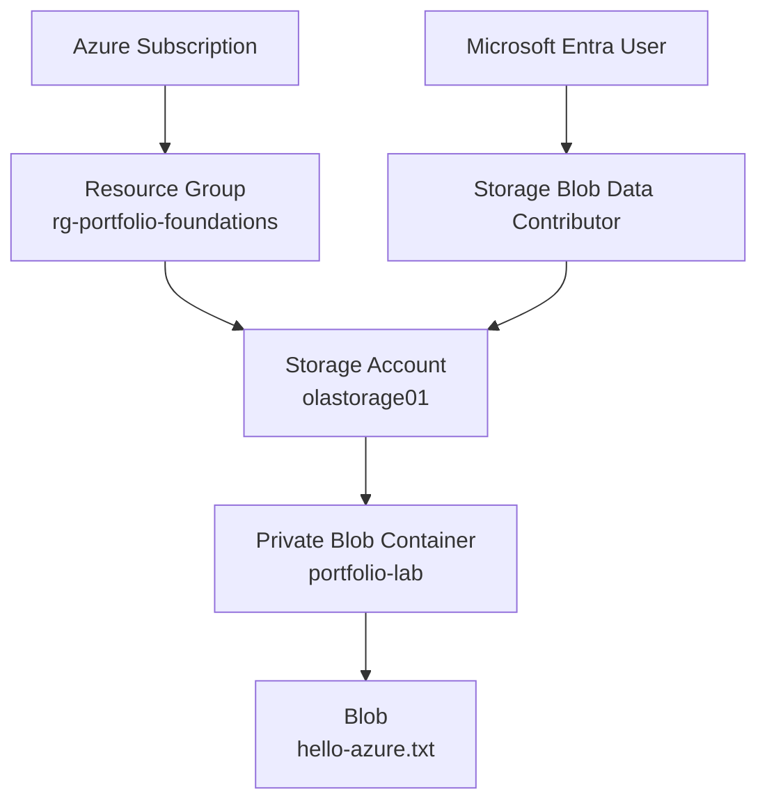
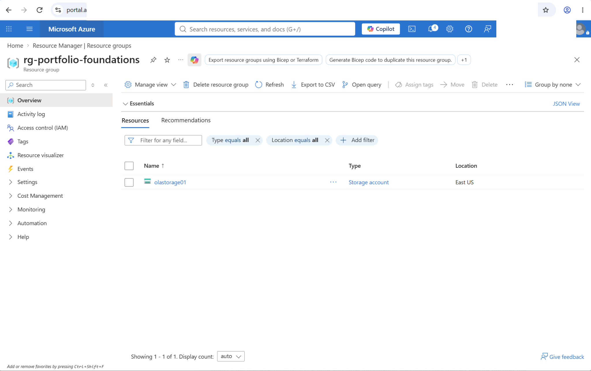
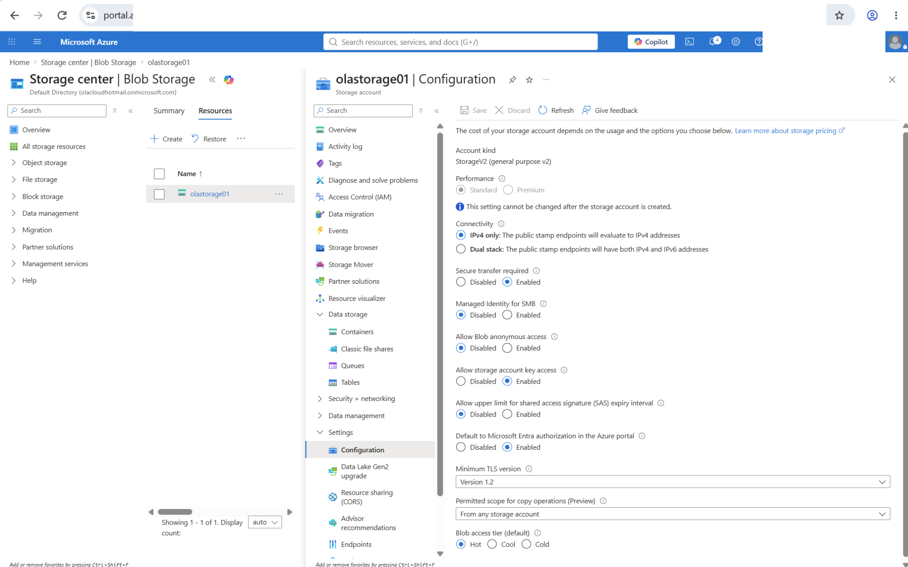
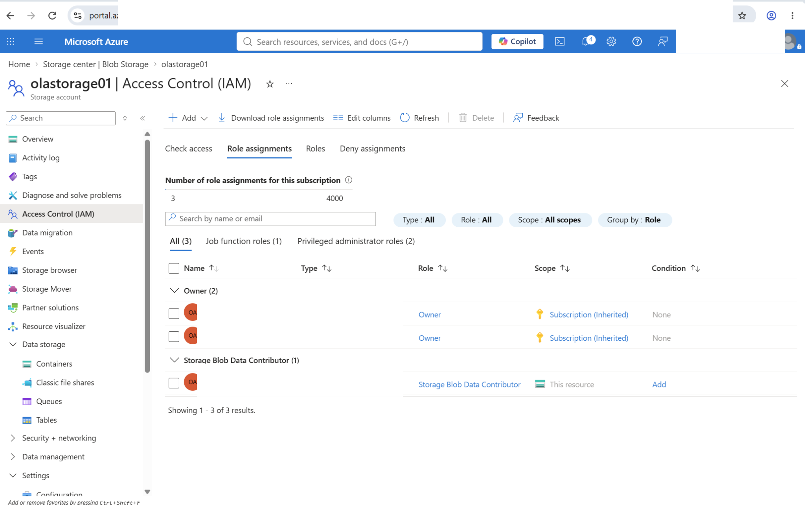
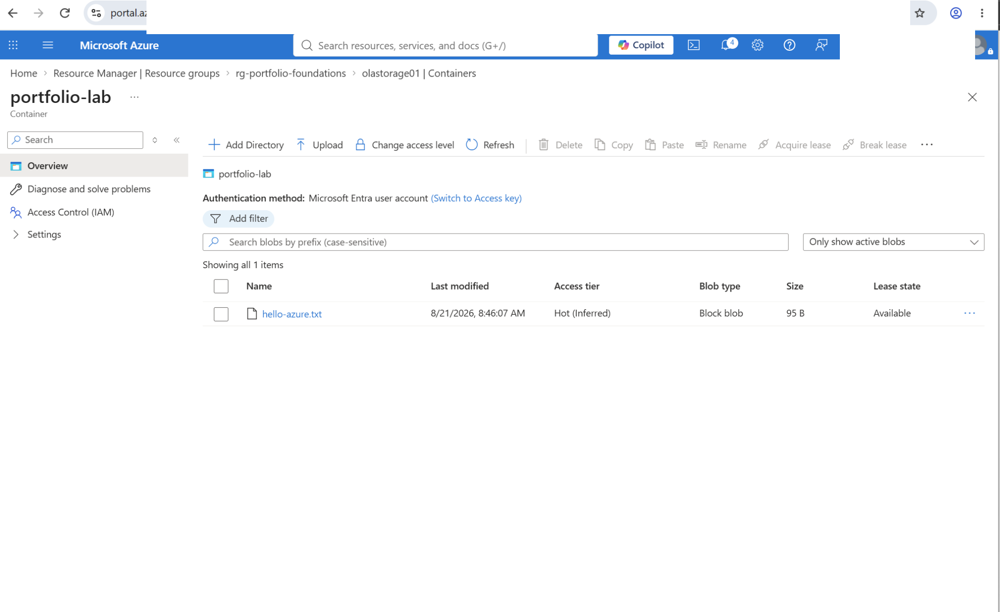
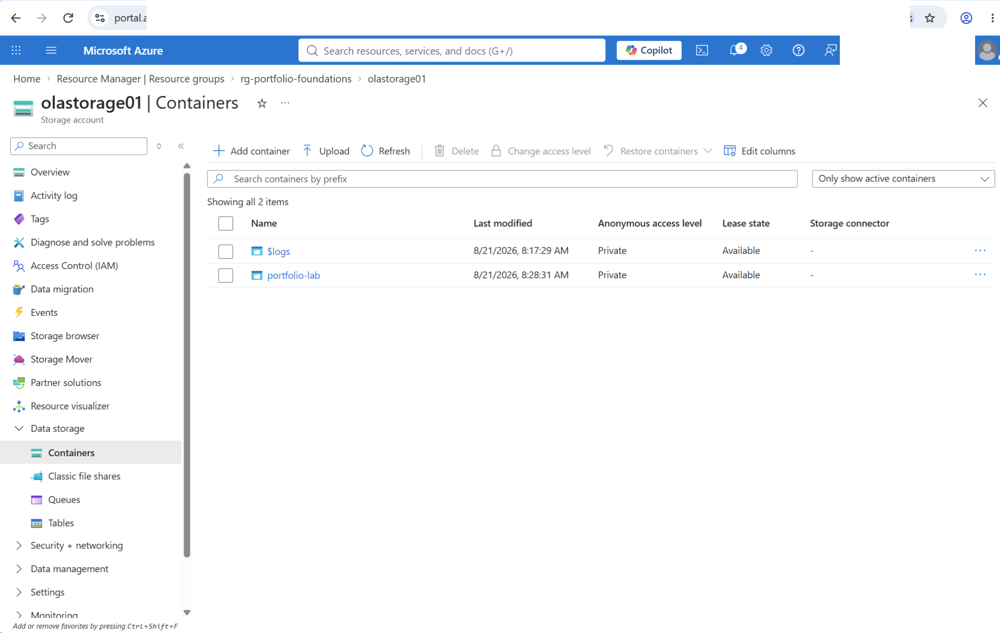
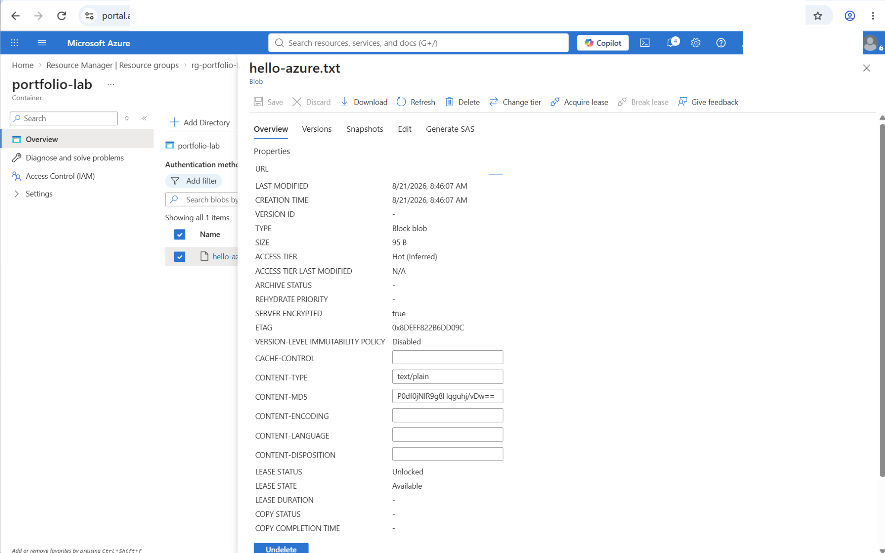

# Azure Blob Storage with RBAC and Microsoft Entra ID

## Project Overview

This project focuses on Azure Blob Storage, Microsoft Entra ID, and Azure RBAC.

The goal was to create an Azure Storage account, create a private Blob container, and securely access the data using Microsoft Entra authentication and role-based access control.

One area I wanted to understand better was the difference between having permission to manage an Azure resource and having permission to access the actual data stored inside it.

The project helped make that difference clearer through configuration and access testing.

**Status:** Completed

---

## Objective

The main objectives were to:

* Create a resource group and storage account
* Create a private Blob container
* Configure basic storage security settings
* Use Microsoft Entra ID for authentication
* Use Azure RBAC to control access to Blob data
* Upload a test file and confirm authenticated access
* Understand management-plane and data-plane permissions
* Document and validate the configuration

---

## Architecture



The resource structure for the lab was:

```text
Azure Subscription
└── rg-portfolio-foundations
    └── olastorage01
        └── portfolio-lab
            └── hello-azure.txt
```

### Azure Resource Hierarchy

The storage account was organized inside the `rg-portfolio-foundations` resource group.



---

## Azure Services Used

| Service | Purpose |
| --- | --- |
| Azure Resource Group | Organized the resources for the lab |
| Azure Storage Account | Hosted the storage service |
| Azure Blob Storage | Stored the test file |
| Microsoft Entra ID | Provided user authentication |
| Azure RBAC | Controlled access to Blob data |
| Azure Portal | Used to configure and manage the resources |
| Azure Storage Browser | Used to test access to the Blob |

---

## Storage Configuration

The StorageV2 account used the following settings:

| Setting | Configuration |
| --- | --- |
| Performance | Standard |
| Replication | LRS |
| Location | East US |
| Access tier | Hot |
| Secure transfer | Enabled |
| Minimum TLS | 1.2 |
| Blob anonymous access | Disabled |
| Microsoft Entra authorization | Enabled |
| Blob soft delete | Enabled - 7 days |
| Container soft delete | Enabled - 7 days |
| Public network access | Enabled |

I chose Standard performance and LRS because this was a small lab and did not need the additional cost or redundancy of a production workload.

The Hot access tier was also suitable because the test Blob was being actively accessed during testing.

### Storage Security Settings

Secure transfer was enabled, the minimum TLS version was set to 1.2, anonymous Blob access was disabled, and Microsoft Entra authorization was used.



---

## Security Configuration

The Blob container was kept private and anonymous Blob access was disabled.

Instead of making the data publicly available, access was handled through Microsoft Entra ID and Azure RBAC.

Blob and container soft delete were also enabled for 7 days. This provides a short recovery period if a Blob or container is deleted by mistake.

### Public Network Access

Public network access was intentionally left enabled for this project.

I considered adding network restrictions, but the main focus here was Blob Storage, Microsoft Entra authentication, and RBAC. Adding private networking would have introduced another layer that was not necessary for the main goal of the project.

The container itself remained private and anonymous Blob access was disabled. This meant the data still required authentication and the correct permissions.

For a more restricted environment, storage firewall rules, Private Endpoints, and Private Link could be added.

---

## RBAC Configuration

Blob data access was provided using:

**Role:** `Storage Blob Data Contributor`

**Assigned to:** Microsoft Entra user

**Scope:** `olastorage01` storage account

This role provided the Blob data permissions needed for the project.

The role was assigned at the storage account level. In a larger environment, I would also consider whether the role could be assigned at a narrower scope based on what the user actually needs to access.

### RBAC Role Assignment

The screenshot below shows the `Storage Blob Data Contributor` role assigned to the Microsoft Entra user at the storage account scope.



---

## Authentication

Blob access was tested using:

**Microsoft Entra ID authentication**

The access method demonstrated in this project did not use:

* Anonymous access
* Storage account keys
* Connection strings
* SAS tokens

This allowed access to be tied to an authenticated Azure identity instead of a shared storage credential.

### Authenticated Blob Access

The private container was successfully accessed using Microsoft Entra authentication.



---

## Implementation

### 1. Resource Group

Created:

`rg-portfolio-foundations`

A separate resource group was used to keep the Azure portfolio resources organized.

### 2. Storage Account

Created:

`olastorage01`

The storage and security settings listed above were then configured.

### 3. Private Blob Container

Created:

`portfolio-lab`

The container was configured as private.



### 4. RBAC

The Microsoft Entra user was assigned:

`Storage Blob Data Contributor`

at the storage account scope.

### 5. Test File

Uploaded:

`hello-azure.txt`

to the `portfolio-lab` container.

### 6. Access Test

Azure Storage Browser was used with Microsoft Entra authentication to test access.

The `hello-azure.txt` Blob was successfully available inside the private container.



---

## Validation

After completing the configuration, I checked the main parts of the project.

The following were confirmed:

* The resource group and storage account were created successfully
* The `portfolio-lab` container was private
* Anonymous Blob access was disabled
* The Microsoft Entra user had the `Storage Blob Data Contributor` role
* `hello-azure.txt` uploaded successfully
* The Blob could be accessed using Microsoft Entra authentication

The successful access test confirmed that the Blob data RBAC permissions were working.

---

## Evidence

Screenshots from the implementation and validation are stored in the `images` folder and included throughout this README.

| Screenshot | Shows |
| --- | --- |
| `01-rbac-role-assignment.png` | Storage Blob Data Contributor assignment |
| `02-storage-security.png` | Storage account security settings |
| `03-private-container.png` | Private Blob container |
| `04-authenticated-blob-access.png` | Blob access using Microsoft Entra authentication |
| `05-hello-azure.png` | Uploaded `hello-azure.txt` |
| `06-resource-hierarchy.png` | Azure resource organization |

---

## Security Considerations

Before publishing the screenshots, I reviewed them and removed sensitive or unnecessary account information.

This included:

* Subscription ID
* Tenant ID
* Object ID
* Email or account identifiers
* Storage account access keys
* Connection strings
* SAS tokens
* Access tokens
* Passwords or secrets

Only sanitized screenshots are included in the public repository.

This was also a useful reminder that screenshots can expose information even when the Azure configuration itself is secure.

---

## Cost Considerations

This project was kept small and inexpensive.

Standard storage with LRS was used, and only a small test file was stored. There were no virtual machines or other compute resources running as part of the project.

For a production environment, the storage configuration would need to be chosen based on availability, redundancy, performance, and recovery requirements rather than only cost.

---

## What I Learned

One of the most useful lessons from this project was understanding the difference between **management-plane permissions** and **data-plane permissions**.

Being able to manage a storage account does not automatically provide access to the files stored inside it.

Azure separates the two:

```text
Management Plane
      ↓
Manage the Storage Account


Data Plane
      ↓
Access Containers and Blobs
```

Microsoft Entra ID handles authentication, while Azure RBAC controls what the authenticated identity is allowed to do.

For this project, `Storage Blob Data Contributor` provided the Blob data permissions needed to access the private container.

Another useful part of the project was deciding where to stop adding features.

I could have added network restrictions, Private Endpoints, monitoring, and other security controls, but that would have changed the focus of the project. Keeping the scope around storage, identity, and RBAC made it easier to understand and test each part properly.

The project also reinforced the importance of testing access after configuring RBAC instead of assuming that a role assignment is working just because it appears in the Azure portal.

---

## Future Improvements

This project can be extended with:

* Storage firewall rules
* Private Endpoints
* Azure Private Link
* Private DNS
* More granular RBAC assignments
* Azure Monitor and diagnostic logs
* Azure Policy
* Infrastructure as Code
* Automated configuration and validation

These would provide stronger network isolation, monitoring, governance, and repeatable deployment.

---

## Technologies

* Microsoft Azure
* Azure Blob Storage
* Microsoft Entra ID
* Azure RBAC
* Azure Resource Groups
* Azure Portal
* Azure Storage Browser
* GitHub
* Markdown

---

## Project Status

**Completed**

This project demonstrates hands-on work with Azure Blob Storage, Microsoft Entra ID, Azure RBAC, private Blob access, storage security, and access validation.
