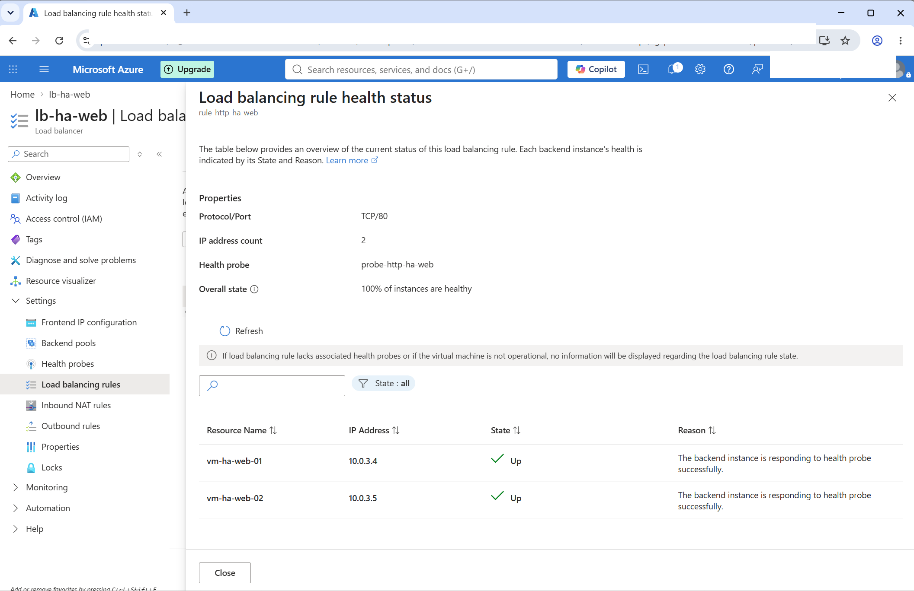
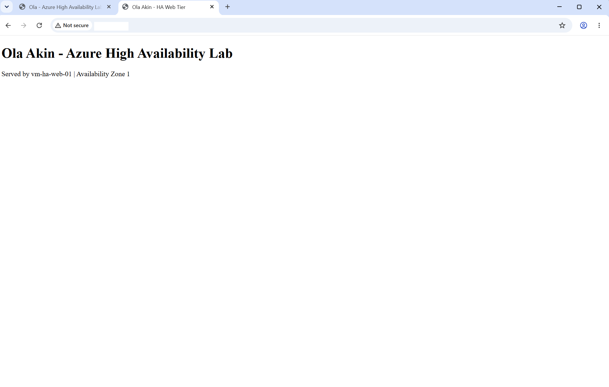
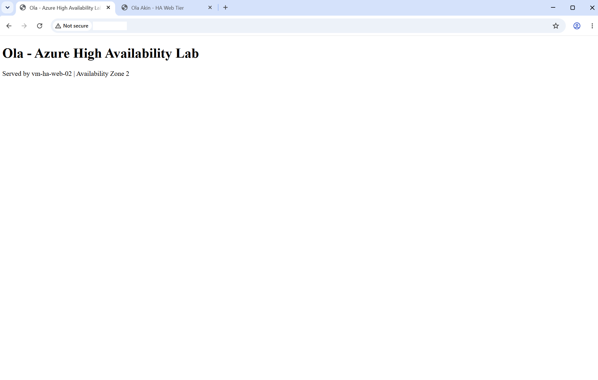
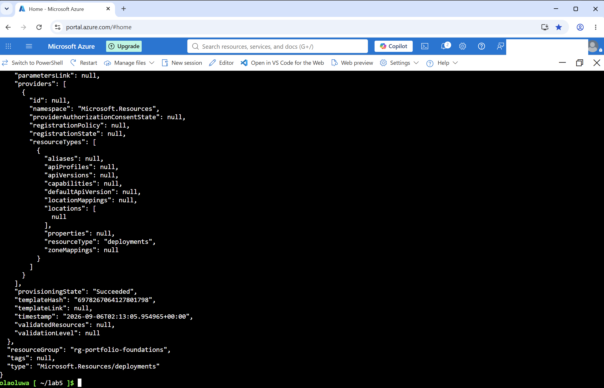

# Azure High Availability & Resiliency

## Overview

This project builds and validates a highly available Azure web tier across multiple Availability Zones.

The environment uses two Ubuntu web servers placed in separate Availability Zones behind an Azure Standard Load Balancer. Health probes determine which backend instances are available to receive traffic, while a NAT Gateway provides explicit outbound connectivity for the private backend subnet.

One thing I wanted to test in this project was whether the application would actually remain available when one backend stopped responding, rather than relying only on Azure showing the configuration as healthy. The lab therefore includes real failure testing in both directions, along with Infrastructure as Code using Bicep.

---

## Architecture

```text
                         Internet
                            │
                            ▼
                Azure Standard Load Balancer
                     TCP/80 Health Probe
                            │
                  ┌─────────┴─────────┐
                  │                   │
                  ▼                   ▼
            vm-ha-web-01         vm-ha-web-02
                Zone 1               Zone 2
                  │                   │
                  └─────────┬─────────┘
                            │
                       snet-ha-web
                       10.0.3.0/24
                            │
                      NAT Gateway
                            │
                            ▼
                         Internet
                     (Outbound only)
```

The backend virtual machines do not have individual public IP addresses. Public web traffic enters through the Load Balancer, while outbound Internet access from the private subnet is provided through the NAT Gateway.

---

## Azure Resources

| Resource | Purpose |
|---|---|
| `vnet-portfolio-lab` | Existing Azure virtual network |
| `snet-ha-web` | Dedicated HA web subnet |
| `nsg-ha-web` | Network security for the HA subnet |
| `vm-ha-web-01` | Ubuntu web server in Availability Zone 1 |
| `vm-ha-web-02` | Ubuntu web server in Availability Zone 2 |
| `lb-ha-web` | Standard public Azure Load Balancer |
| `be-pool-ha-web` | Load Balancer backend pool |
| `probe-http-ha-web` | TCP/80 health probe |
| `rule-http-ha-web` | TCP/80 load-balancing rule |
| `natgw-ha-web` | Explicit outbound connectivity for private backend VMs |
| `nat-pip-ha-web` | Public IP used by the NAT Gateway |

---

## Network Design

The existing `vnet-portfolio-lab` virtual network was extended with a dedicated subnet:

```text
snet-web       10.0.1.0/24
snet-app       10.0.2.0/24
snet-ha-web    10.0.3.0/24
```

The HA web subnet was configured as a private subnet without default outbound access.

`nsg-ha-web` allows:

- HTTP TCP/80 for application traffic
- Virtual network traffic for internal communication
- Azure Load Balancer health probe traffic
- All other inbound traffic is denied by the default NSG deny rule

The backend VMs have no public IP addresses.

---

## Availability Zone Design

Two Ubuntu 24.04 LTS virtual machines were deployed across separate Azure Availability Zones:

```text
vm-ha-web-01 → Availability Zone 1
vm-ha-web-02 → Availability Zone 2
```

Both VMs use Trusted Launch with Secure Boot and vTPM.

Distributing the web tier across separate zones reduces the risk of a single-zone infrastructure failure taking down the entire application tier.

---

## Explicit Outbound Connectivity

The HA subnet was intentionally created without default outbound access.

During deployment, cloud-init attempted to install Nginx but failed because the private backend VM could not reach the Ubuntu package repositories.

```text
Cloud-init
    ↓
apt package installation
    ↓
Unable to reach Ubuntu repositories
    ↓
No explicit outbound path
```

One useful troubleshooting part of this project came from tracing that failure. The VM itself was running correctly, but the package installation could not reach the Internet. I traced the problem to the private subnet having no outbound path and chose to add a NAT Gateway instead of assigning public IP addresses to the backend VMs.

```text
Private VM
    ↓
snet-ha-web
    ↓
natgw-ha-web
    ↓
Internet
```

After adding the NAT Gateway:

- `apt-get update` succeeded
- Nginx installed successfully
- the service started successfully
- local HTTP testing returned the expected web page

This preserved the private backend design while providing explicit outbound Internet connectivity.

---

## Load Balancer Configuration

A Standard regional public Azure Load Balancer was configured with:

```text
Frontend:
fe-ip-ha-web

Backend Pool:
be-pool-ha-web

Backend Instances:
vm-ha-web-01
vm-ha-web-02

Health Probe:
probe-http-ha-web
TCP/80
5-second interval

Load Balancing Rule:
rule-http-ha-web
TCP/80 → TCP/80
```

Outbound SNAT through the Load Balancer rule was disabled because outbound connectivity is handled separately by the NAT Gateway.

Both backend VMs remained private and received inbound application traffic through the Load Balancer.

---

## Health Validation

After configuration, Azure reported:

```text
Overall health: 100%

vm-ha-web-01 → Up
vm-ha-web-02 → Up
```

Both instances successfully responded to the TCP/80 health probe.



---

## Failure & Resiliency Testing

Configuration alone does not prove that failover works, so I tested the web tier by intentionally stopping Nginx on each backend separately and accessing the application through the same Load Balancer frontend.

### Test 1 — VM 2 Web Service Failure

Nginx was stopped on `vm-ha-web-02`.

The Load Balancer health probe detected that the backend was unavailable and traffic continued through:

```text
vm-ha-web-01
Availability Zone 1
```

The application remained accessible through the same Load Balancer frontend.



### Test 2 — VM 1 Web Service Failure

Nginx was restored on VM 2 and then stopped on `vm-ha-web-01`.

Traffic continued through:

```text
vm-ha-web-02
Availability Zone 2
```

Again, the application remained available through the same Load Balancer frontend.



I restored both Nginx services after testing and confirmed that Azure returned to 100% backend health. Testing both directions gave me stronger validation than simply seeing two healthy VMs in the Portal.

---

## Infrastructure as Code

The HA environment is represented using modular Bicep:

```text
bicep/
├── main.bicep
└── modules/
    ├── network.bicep
    ├── compute.bicep
    └── loadbalancer.bicep
```

### Module Responsibilities

**network.bicep**

Represents the HA networking components including:

- existing VNet and subnet references
- Network Security Group
- NAT Gateway public IP
- NAT Gateway

**compute.bicep**

Represents the two HA VM network interfaces and their Load Balancer backend-pool associations.

**loadbalancer.bicep**

References the existing Load Balancer and backend pool so their identifiers can safely be consumed by the compute module.

**main.bicep**

Orchestrates the modules and passes resource identifiers between them.

---

## Bicep Change-Safety Decision

While converting the environment to Bicep, I found that a template can compile successfully and still be unsafe to deploy.

The initial Load Balancer representation declared the existing backend pool as part of the deployable Load Balancer resource. The Bicep build succeeded, but ARM What-If predicted that deployment could remove the existing NIC-based backend membership.

Rather than deploying and assuming Azure would reconstruct those relationships correctly, I stopped before deployment and changed the design.

The final approach was:

```text
Existing Load Balancer
        │
        ▼
Existing Backend Pool
        │
        ▼
Backend Pool ID
        │
        ▼
Deployable NIC configuration
```

The working Load Balancer and backend pool are therefore referenced as existing resources rather than unnecessarily redeployed.

After the redesign:

- Bicep compiled with no errors or warnings
- the destructive Load Balancer prediction disappeared from What-If
- backend-pool associations showed no effective change
- the deployment completed successfully
- both backend instances remained healthy afterward

This was an important part of the project because it showed why Infrastructure as Code should be treated as a controlled change process rather than simply deploying a template because it compiles.

---

## Bicep Deployment

The final modular Bicep deployment completed successfully using incremental deployment mode.



After deployment, I checked the Load Balancer again and confirmed that both backend instances were still healthy. This verified that the IaC deployment had not disrupted the working HA configuration.

---

## Troubleshooting & Engineering Decisions

### Cloud-init Failed on the Private Subnet

**Problem**

Nginx was not installed during the first VM deployment.

**Investigation**

The VM itself was healthy, but cloud-init logs showed that Ubuntu package repositories could not be reached.

**Root Cause**

`snet-ha-web` had intentionally been created without default outbound Internet access.

**Resolution**

A NAT Gateway was added to provide explicit outbound connectivity without exposing the backend VMs with public IP addresses.

---

### Unsafe Load Balancer Change Predicted by ARM What-If

**Problem**

The Bicep representation compiled successfully, but ARM What-If predicted removal of existing Load Balancer backend membership.

**Decision**

The deployment was stopped before making the potentially destructive change.

**Resolution**

The Bicep architecture was adjusted so the working Load Balancer and backend pool were referenced as existing resources while the NICs retained their backend-pool associations.

A second What-If confirmed that the destructive Load Balancer change was gone before deployment proceeded.

---

## Security Considerations

The design applies several security principles:

- backend VMs have no public IP addresses
- SSH authentication uses public/private key authentication
- private SSH keys are not stored on the jump host
- subnet-level NSG controls inbound traffic
- Trusted Launch is enabled on the backend VMs
- Secure Boot and vTPM are enabled
- outbound Internet access is explicit through NAT Gateway
- Load Balancer health probes determine backend availability
- sensitive subscription, account, and public IP information is excluded from portfolio evidence

---

## Skills Demonstrated

- Azure Availability Zones
- Azure Standard Load Balancer
- Backend pools
- Health probes
- Load-balancing rules
- Azure Virtual Networks and subnets
- Network Security Groups
- NAT Gateway
- Private VM architecture
- Linux and Nginx administration
- Cloud-init troubleshooting
- Azure CLI
- Bicep
- Modular Infrastructure as Code
- ARM What-If
- Safe infrastructure change management
- High-availability testing
- Failure simulation and recovery validation
- Azure troubleshooting

---

## Key Lessons

This project helped me understand that high availability is not just about having two VMs.

The complete design depends on several layers working together:

```text
Availability Zones
        +
Multiple Backend Instances
        +
Health Probes
        +
Load Balancing
        +
Network Security
        +
Outbound Connectivity
        +
Failure Testing
```

It also reinforced an important IaC lesson: a template that compiles successfully is not automatically safe to deploy.

ARM What-If identified a potentially destructive change before it reached the environment. Reviewing that output and changing the Bicep design preserved the working architecture.

The final result was validated through both Azure health status and real two-direction application failover.
