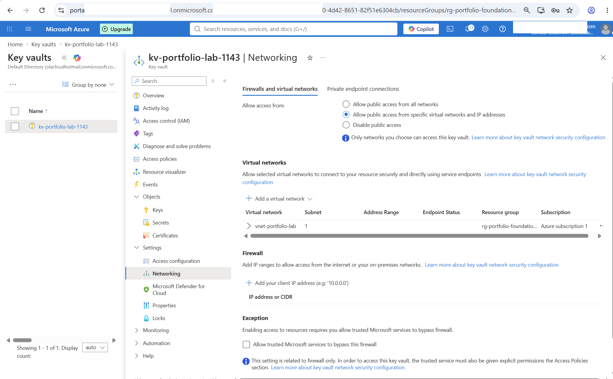
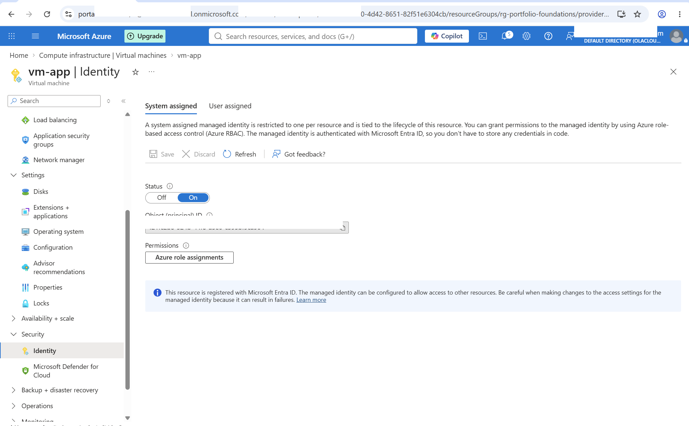
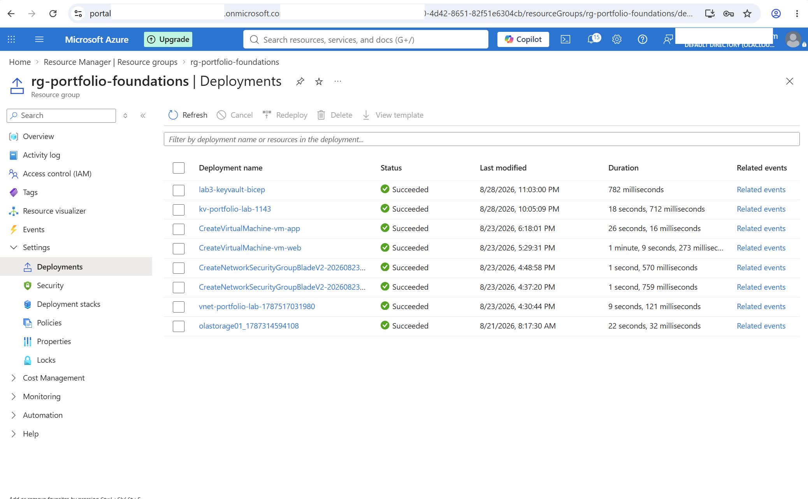
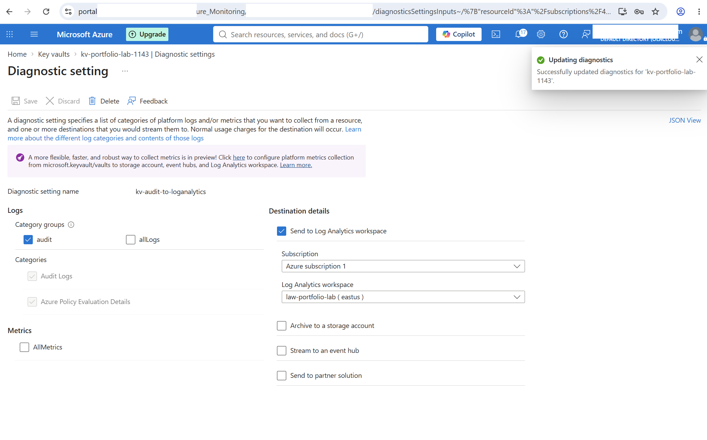
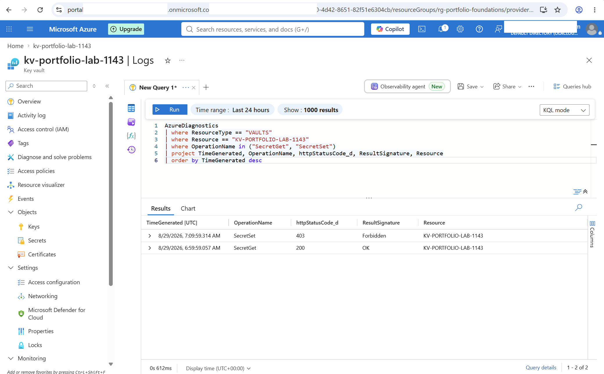
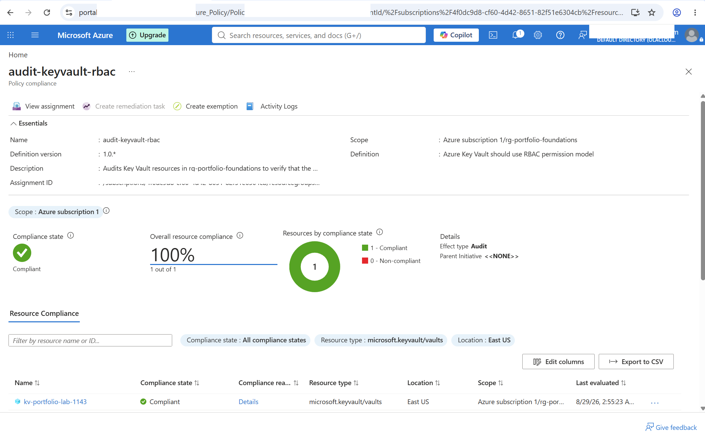

# Azure Key Vault + Managed Identity - Passwordless Secret Access

## Overview

This lab demonstrates how an Azure virtual machine can securely access secrets stored in Azure Key Vault without storing passwords, access keys, or application credentials on the VM.

The solution uses a system-assigned managed identity for authentication, Microsoft Entra ID for identity verification, Azure RBAC for least-privilege authorization, Key Vault network restrictions, Log Analytics for security monitoring, Azure Policy for governance, and Bicep for infrastructure-as-code validation.

The lab builds on the private application tier created in the previous Azure networking lab.

---

## Architecture

```text
vm-app
  |
  | System-Assigned Managed Identity
  v
Microsoft Entra ID
  |
  | Azure RBAC
  | Key Vault Secrets User
  v
Azure Key Vault
  |
  +-- SecretGet --> 200 OK
  |
  +-- SecretSet --> 403 Forbidden

Monitoring:
Azure Key Vault
  |
  v
Diagnostic Settings
  |
  v
Log Analytics Workspace

Governance:
Azure Policy
  |
  v
Audit Key Vault RBAC Permission Model
```

---

## Azure Resources

| Resource | Purpose |
|---|---|
| `vm-app` | Private application VM using managed identity |
| `kv-portfolio-lab-1143` | Stores application secrets |
| `vnet-portfolio-lab` | Existing virtual network |
| `snet-app` | Private application subnet |
| `law-portfolio-lab` | Central Log Analytics workspace |
| `audit-keyvault-rbac` | Azure Policy assignment auditing the Key Vault RBAC model |

---

## Security Design

The lab follows several cloud security principles:

- No Azure credentials stored on the VM
- No passwords or secrets embedded in source code
- System-assigned managed identity for authentication
- Microsoft Entra ID token-based authentication
- Azure RBAC instead of legacy Key Vault access policies
- Least-privilege secret permissions
- Restricted Key Vault network access
- No public IP address on the application VM
- Key Vault audit logging through Azure Monitor
- Azure Policy governance
- Infrastructure represented and validated with Bicep

---

## 1. Private Application VM

The existing `vm-app` virtual machine from the previous networking lab was reused.

The VM remains on the private application subnet and does not have a public IP address.

The VM security configuration also uses:

- Trusted Launch
- Secure Boot
- Virtual TPM (vTPM)

Administrative access continues through the existing web-tier VM rather than exposing the application VM directly to the Internet.

---

## 2. Azure Key Vault

A Key Vault named `kv-portfolio-lab-1143` was deployed using the Standard tier.

Security settings include:

- Azure RBAC permission model
- Soft delete enabled
- 90-day retention
- Public network access restricted to selected networks
- Application subnet explicitly allowed
- Trusted Microsoft services bypass disabled

The application subnet uses the Microsoft Key Vault service endpoint to securely reach the vault while maintaining the network restrictions.



---

## 3. System-Assigned Managed Identity

A system-assigned managed identity was enabled on `vm-app`.

This creates an identity in Microsoft Entra ID that is tied directly to the lifecycle of the virtual machine.

The application can therefore request Azure access tokens without storing:

- usernames
- passwords
- client secrets
- service principal credentials



---

## 4. Least-Privilege Azure RBAC

The `vm-app` managed identity was assigned:

**Key Vault Secrets User**

The role was assigned at the Key Vault scope rather than at the resource group or subscription level.

This follows the principle of least privilege by allowing the workload to read secret values without granting permission to create, modify, or delete secrets.

Administrative secret management was kept separate from the application's runtime permissions.

---

## 5. Passwordless Authentication

From `vm-app`, the Azure Instance Metadata Service was used to obtain an access token for Azure Key Vault.

The token was stored temporarily in the shell and was not printed or committed to source control.

The managed identity successfully obtained a Microsoft Entra access token:

```text
token_type: Bearer
access_token_received: True
```

No application password, client secret, or Azure credential was required.

---

## 6. Authorized Secret Read Test

A safe test secret named:

```text
app-api-key
```

was created in Key Vault.

The managed identity then attempted to retrieve the secret through the Key Vault REST API.

Result:

```text
HTTP 200
```

This confirmed that:

1. The VM could authenticate using its managed identity.
2. Microsoft Entra ID issued the required access token.
3. Azure RBAC authorized the identity.
4. Key Vault networking allowed the request.
5. The identity could retrieve the required secret.

The secret value itself was not included in the repository or documentation.

---

## 7. Least-Privilege Denied Write Test

The same managed identity attempted to create or modify a secret.

Result:

```text
HTTP 403 Forbidden
```

This was intentional.

The result demonstrates that the `Key Vault Secrets User` role provides the application with the permissions it needs to read secrets while preventing it from managing secrets.

This provides practical validation of least-privilege authorization rather than relying only on the configured role assignment.

---

## 8. Infrastructure as Code with Bicep

The Key Vault configuration was represented using Bicep.

The template uses:

```text
Microsoft.KeyVault/vaults@2026-02-01
```

The Bicep configuration represents:

- Standard Key Vault SKU
- Azure RBAC authorization
- Soft-delete retention
- Restricted public network access
- Default network deny
- Existing application subnet authorization

The template was compiled successfully and validated using Azure CLI.

A What-If deployment was also performed before the real deployment.

The final What-If result showed:

```text
Resource changes: 1 no change
```

This confirmed that the Bicep representation matched the existing Key Vault configuration without introducing an unintended change.

The deployment was then completed successfully.



The Bicep source is available here:

[`bicep/main.bicep`](bicep/main.bicep)

---

## 9. Key Vault Monitoring with Log Analytics

A Log Analytics workspace named:

```text
law-portfolio-lab
```

was created for security monitoring.

A Key Vault diagnostic setting named:

```text
kv-audit-to-loganalytics
```

was configured to send Key Vault audit logs to the workspace.



After logging became active, new authorization tests were generated from `vm-app`.

The audit logs captured both successful and denied operations.

### Successful authorized access

```text
Operation: SecretGet
HTTP Status: 200
Result: OK
```

### Denied unauthorized operation

```text
Operation: SecretSet
HTTP Status: 403
Result: Forbidden
```



This demonstrates that the environment not only enforces access controls but also provides visibility into security-relevant activity.

---

## 10. Azure Policy Governance

Azure Policy was added as a governance layer.

The built-in policy:

```text
Azure Key Vault should use RBAC permission model
```

was assigned to the portfolio resource group.

Assignment:

```text
audit-keyvault-rbac
```

Effect:

```text
Audit
```

The policy evaluates Key Vault resources without automatically modifying them.

After Azure Policy completed its evaluation, the Key Vault reported:

```text
Compliance state: Compliant
Overall resource compliance: 100%
Compliant resources: 1
Non-compliant resources: 0
```



This provides independent governance validation that the Key Vault follows the required Azure RBAC authorization model.

---

## Validation Summary

| Test | Expected | Result |
|---|---|---|
| Managed identity enabled | Enabled | PASS |
| Managed identity token request | Token received | PASS |
| Secret read | HTTP 200 | PASS |
| Secret write | HTTP 403 | PASS |
| Application VM public IP | None | PASS |
| Key Vault RBAC authorization | Enabled | PASS |
| Key Vault network restriction | Selected network | PASS |
| Bicep validation | Successful | PASS |
| Bicep What-If | No unintended change | PASS |
| Bicep deployment | Successful | PASS |
| Key Vault audit logging | Events received | PASS |
| Authorized read audit | 200 OK | PASS |
| Unauthorized write audit | 403 Forbidden | PASS |
| Azure Policy RBAC audit | Compliant | PASS |

---

## Key Lessons

This lab demonstrated the difference between authentication and authorization.

Managed identity answers:

> Who is the workload?

Microsoft Entra ID authenticates that identity.

Azure RBAC answers:

> What is the workload allowed to do?

Key Vault then enforces those permissions.

The successful `SecretGet` and denied `SecretSet` demonstrate that authentication alone does not provide unrestricted access.

The lab also demonstrated that secure cloud engineering extends beyond access control. Log Analytics provides operational visibility, Azure Policy provides governance, network restrictions reduce exposure, and Bicep makes infrastructure configuration repeatable and reviewable.

---

## Security Considerations

No production secrets, credentials, private SSH keys, bearer tokens, access keys, or connection strings are included in this repository.

Screenshots were sanitized before publication to remove account identifiers and other unnecessary environment-specific information.

The test secret used during the lab contained demonstration data only.

---

## Skills Demonstrated

- Azure Key Vault
- Microsoft Entra ID
- Azure Managed Identities
- Azure RBAC
- Least-Privilege Access Control
- Passwordless Authentication
- Azure Virtual Networks
- Service Endpoints
- Azure VM Security
- Trusted Launch
- Bicep
- Azure CLI
- Infrastructure as Code
- Azure Monitor
- Log Analytics
- KQL
- Diagnostic Settings
- Azure Policy
- Cloud Security
- Cloud Governance
- Security Validation and Troubleshooting

---

## Related Labs

- [Azure Blob Storage + Entra ID + RBAC](../azure-blob-rbac-lab/)
- [Azure Secure Two-Tier Network Architecture](../azure-secure-two-tier-network/)
