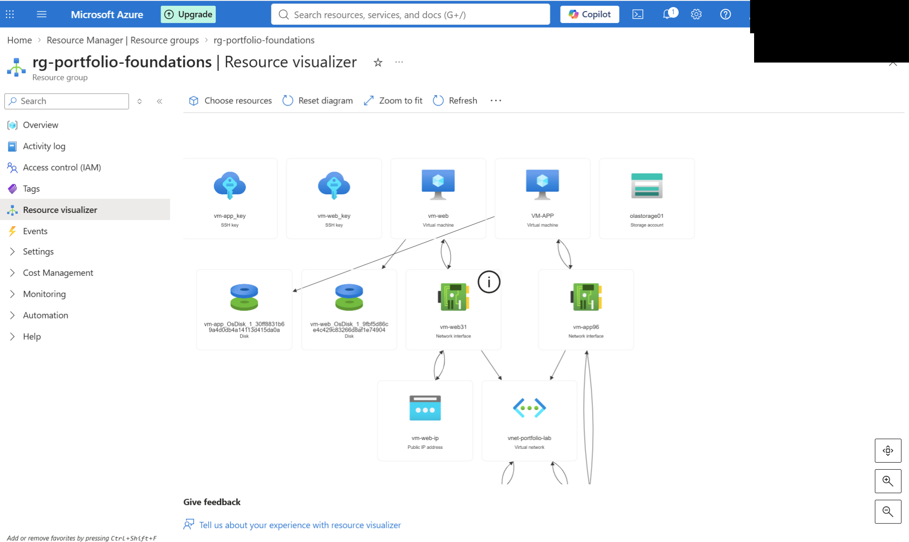
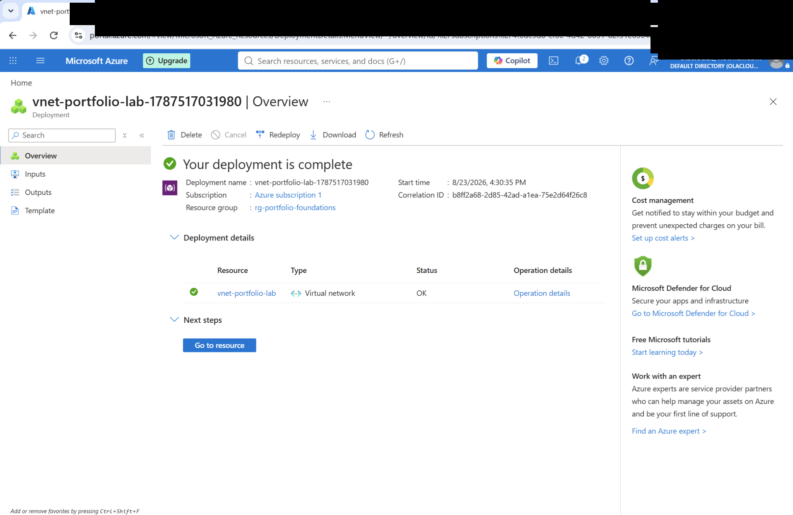
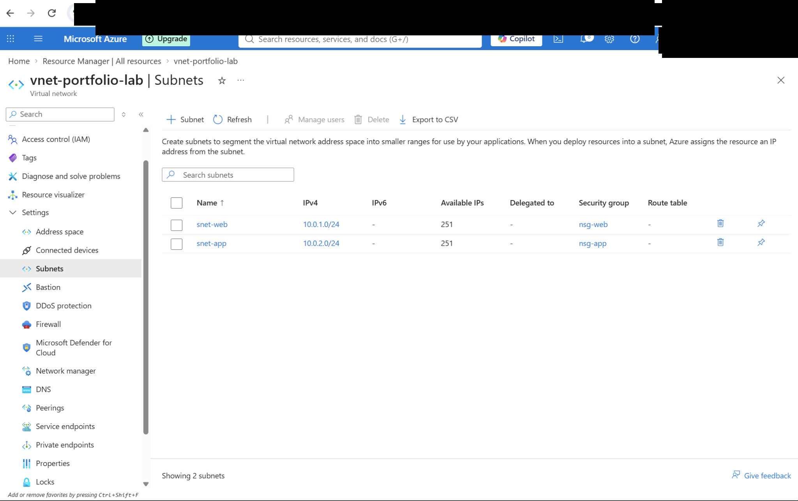
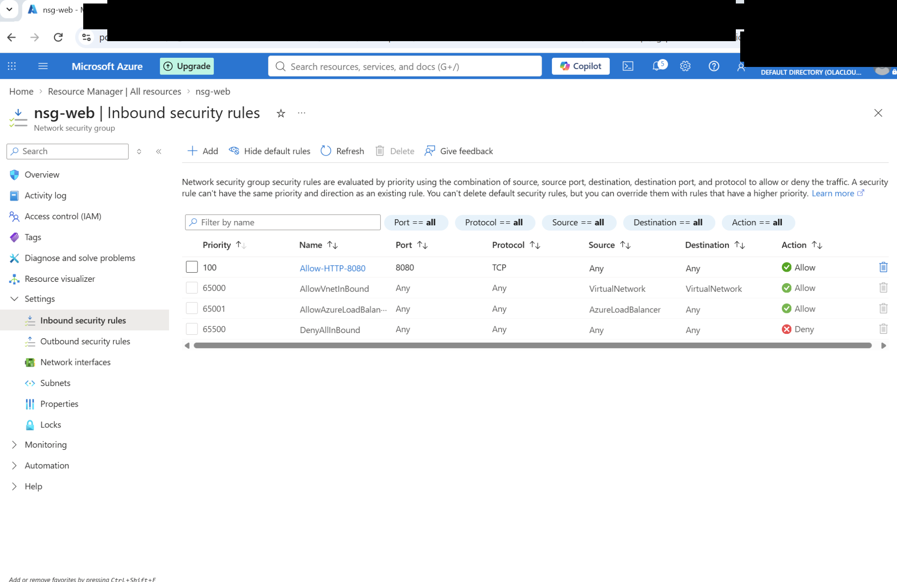
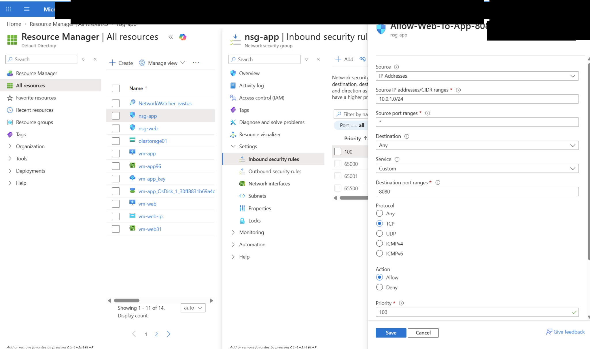
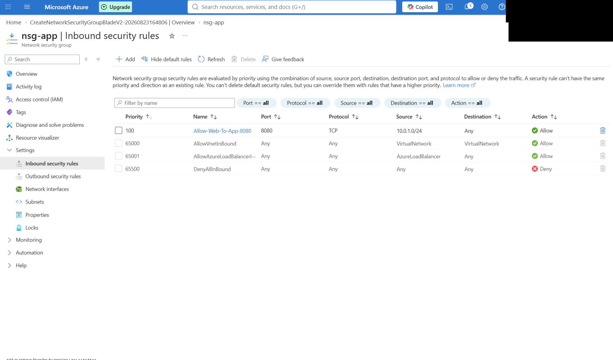
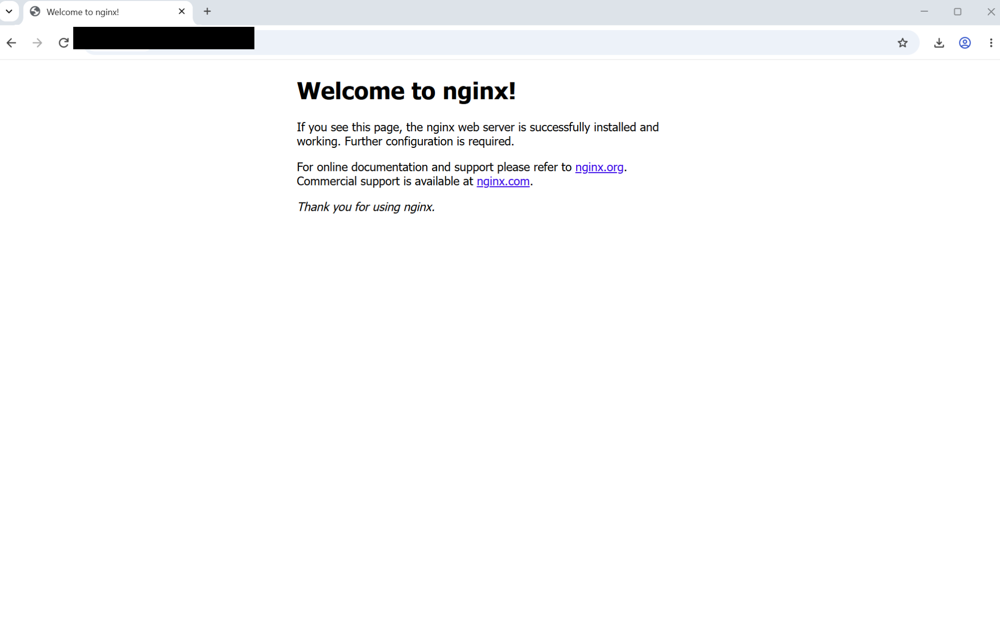
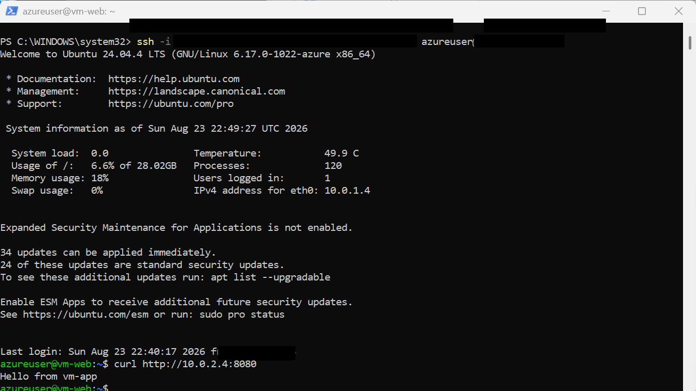
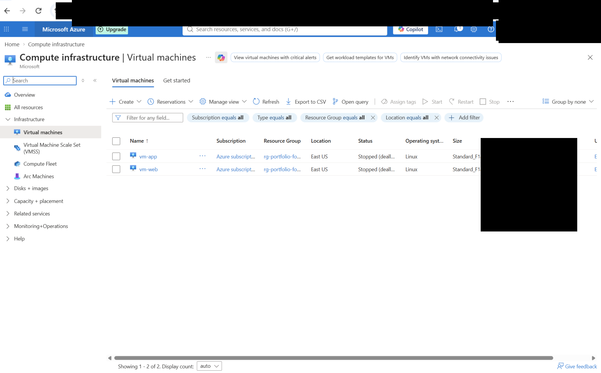

# Azure Secure Two-Tier Network Architecture

## Project Overview

This project focuses on building a segmented two-tier network architecture in Microsoft Azure.

The environment consists of a public-facing web server and a private application server. The two workloads are placed in separate subnets and protected by separate Network Security Groups (NSGs).

The main goal was to allow users to reach the web tier from the Internet while keeping the application tier private. Communication between the two tiers is limited to the application traffic required for the project.

I also wanted to test the design from both sides: confirm that the web service was reachable publicly and then confirm that the web server could communicate with the private application server over the Azure network.

**Status:** Completed

---

## Architecture

The environment includes:

| Component | Configuration |
|---|---|
| Resource Group | `rg-portfolio-foundations` |
| Virtual Network | `vnet-portfolio-lab` |
| Web Subnet | `snet-web` - `10.0.1.0/24` |
| Application Subnet | `snet-app` - `10.0.2.0/24` |
| Web VM | `vm-web` |
| Application VM | `vm-app` |
| Web NSG | `nsg-web` |
| Application NSG | `nsg-app` |
| Web Service Port | TCP `8080` |
| Application Service Port | TCP `8080` |
| Application VM Public IP | None |

### Traffic Flow

```text
Internet
   |
   | TCP 8080
   v
+------------------+
|      vm-web      |
|   Web Subnet     |
|   10.0.1.0/24    |
+------------------+
         |
         | TCP 8080
         v
+------------------+
|      vm-app      |
|   App Subnet     |
|   10.0.2.0/24    |
|   Private Tier   |
+------------------+
```

Azure Resource Visualizer provides an overview of the deployed resources and their relationships.



---

## 1. Virtual Network Deployment

The Azure virtual network was created inside the `rg-portfolio-foundations` resource group.

The successful deployment confirmed that the base network infrastructure was available before configuring the subnets, security rules, and virtual machines.



---

## 2. Network Segmentation

The virtual network was divided into two subnets:

- `snet-web` - `10.0.1.0/24`
- `snet-app` - `10.0.2.0/24`

The web and application workloads were separated instead of placing both virtual machines in the same subnet.

Each subnet also has its own Network Security Group:

- `snet-web` → `nsg-web`
- `snet-app` → `nsg-app`

I wanted the two tiers to have separate security controls so that access to the public web server would not automatically mean the application server needed the same exposure.

This also made the traffic flow easier to understand and control.



---

## 3. Web Tier Security

The web tier is protected by `nsg-web`.

An inbound rule allows TCP port `8080`, which is used by the Nginx web service in this project.

This allows the web service to receive the required external traffic while other inbound traffic remains controlled by the NSG configuration.



---

## 4. Application Tier Security

The application tier is protected separately by `nsg-app`.

Instead of exposing the application service directly to the Internet, an inbound rule named:

`Allow-Web-To-App-8080`

was configured with:

- **Source:** `10.0.1.0/24`
- **Source tier:** Web subnet
- **Destination port:** `8080`
- **Protocol:** TCP
- **Action:** Allow
- **Priority:** 100

The important part of this rule was the source.

The application needed to receive traffic from the web tier, but there was no reason to allow the same application port directly from the Internet. Restricting the source to `10.0.1.0/24` allowed the required communication without unnecessarily exposing the private tier.



The completed `nsg-app` inbound configuration confirms that the custom web-to-application rule is active.



---

## 5. Public Web Server Validation

Nginx was installed and configured on `vm-web`.

The service was tested through the web VM's public IP address using TCP port `8080`.

The Nginx page loaded successfully in the browser, confirming that:

- The web VM was running
- Nginx was responding
- TCP port `8080` was reachable
- The web-tier NSG allowed the required traffic



This test confirmed the public side of the architecture before testing communication with the private application tier.

---

## 6. Web-to-Application Connectivity Validation

After confirming public access to the web tier, communication between the two network tiers was tested.

From `vm-web`, I sent an HTTP request directly to the private IP address of `vm-app` on TCP port `8080`:

```bash
curl http://10.0.2.4:8080
```

The application server returned:

```text
Hello from vm-app
```

This was an important test because it confirmed that the architecture worked as intended, not just that the resources and NSG rules existed in the Azure portal.

The result confirmed:

- `vm-web` could reach the application subnet
- TCP `8080` was allowed between the tiers
- `vm-app` was responding
- Private IP communication was working
- The application VM did not need a public IP for the web tier to reach it



---

## 7. Secure Administration of the Private VM

Keeping `vm-app` private also meant I needed a secure way to administer it.

Instead of assigning a public IP to `vm-app`, administrative access followed this path:

```text
Local Computer
      |
      | SSH
      v
    vm-web
      |
      | Private Azure Network
      v
    vm-app
```

One issue I ran into was SSH private-key permissions on my Windows computer. SSH rejected the key because its file permissions were too open.

After correcting the key permissions, SSH worked correctly.

I also did not want to solve access to `vm-app` by copying my private SSH key onto `vm-web`. Instead, I used SSH agent forwarding so the key could remain on my local computer while `vm-web` was used to reach the private VM.

This allowed `vm-app` to remain private without storing my private SSH key on the web server.

It was a useful part of the project because keeping a server private also means thinking about how it will be managed securely.

---

## 8. Cost Management

After completing the deployment and connectivity tests, both virtual machines were stopped and deallocated.

Deallocating the VMs prevents unnecessary compute charges while keeping the Azure resources available for future testing.



This was also a reminder that finishing the technical work is not the end of a cloud project. Resources that are no longer needed should be stopped, removed, or reviewed for ongoing cost.

---

## Security Design

The main security controls used in this project include:

- Separate web and application subnets
- Separate Network Security Groups for each tier
- Controlled inbound access using NSG rules
- Application traffic restricted to the web subnet
- No public IP address on `vm-app`
- Private communication between Azure workloads
- Only required service ports opened for the project
- SSH used for Linux administration
- SSH agent forwarding used for private VM administration
- Private SSH key kept off the web VM
- Virtual machines deallocated after testing to reduce unnecessary cost

The main design decision was to expose only the tier that needed public access.

`vm-web` accepts the required external traffic, while `vm-app` remains private and receives application traffic from the web subnet.

---

## Validation Results

| Test | Result |
|---|---|
| Virtual network deployment | Successful |
| Web and application subnet creation | Successful |
| NSG association with both subnets | Successful |
| Public access to Nginx on TCP 8080 | Successful |
| Web-to-app communication on TCP 8080 | Successful |
| Application response from private IP | `Hello from vm-app` |
| Application VM directly assigned a public IP | No |
| Private VM administration through web tier | Successful |
| Private SSH key copied to web VM | No |
| VMs deallocated after testing | Completed |

---

## What I Learned

One of the main lessons from this project was that network segmentation is more than creating multiple subnets.

The security rules between those subnets are what determine how the different parts of the environment can communicate.

The web server needed to be reachable externally, but the application server did not. Keeping `vm-app` without a public IP made the reason for separating the tiers much clearer.

The connectivity testing was also important. Seeing an NSG rule in the Azure portal does not prove that the full path works. The public Nginx test confirmed the Internet-to-web path, while:

```bash
curl http://10.0.2.4:8080
```

and:

```text
Hello from vm-app
```

confirmed the web-to-application path.

I also learned that making a VM private creates another question: how do I administer it without weakening the design?

Using `vm-web` as the access path and SSH agent forwarding allowed me to reach `vm-app` without adding a public IP or copying my private SSH key onto another server.

The SSH key permission issue was also useful troubleshooting experience. A connection problem is not always caused by Azure networking or an NSG; in this case, the local private-key permissions also had to be correct.

---

## Security Considerations

Before publishing the project, screenshots were reviewed and sanitized to remove sensitive or unnecessary information.

Information that should not be published includes:

- Subscription IDs
- Tenant IDs
- Account identifiers
- Public IP addresses when they are not needed as evidence
- Private SSH keys
- Authentication tokens
- Passwords or secrets

Private RFC1918 addresses such as `10.0.1.0/24`, `10.0.2.0/24`, and `10.0.2.4` are included because they help explain the network architecture and do not expose publicly routable addresses.

---

## Skills Demonstrated

- Microsoft Azure
- Azure Virtual Networks
- Azure Subnets
- Network Security Groups (NSGs)
- Linux Virtual Machines
- Network Segmentation
- TCP/IP Networking
- CIDR Addressing
- SSH Administration
- SSH Agent Forwarding
- Nginx
- Private IP Communication
- Security Rule Configuration
- Connectivity Testing
- Network Troubleshooting
- Azure Resource Management
- Cloud Cost Management

---

## Project Result

The final environment provides a working two-tier Azure architecture with separate web and application network segments.

The web tier can receive the required external traffic, while the application tier remains private. Communication from `vm-web` to `vm-app` was successfully tested over the Azure private network using TCP port `8080`.

More importantly, the project gave me practical experience with the decisions around segmentation, controlled traffic flow, private workload access, secure administration, testing, troubleshooting, and cloud cost management.
