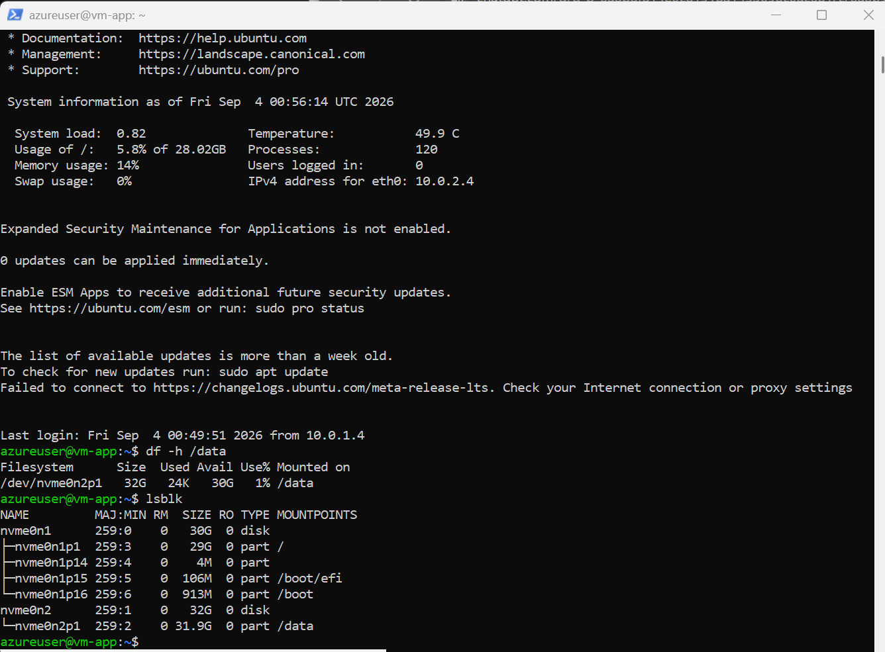
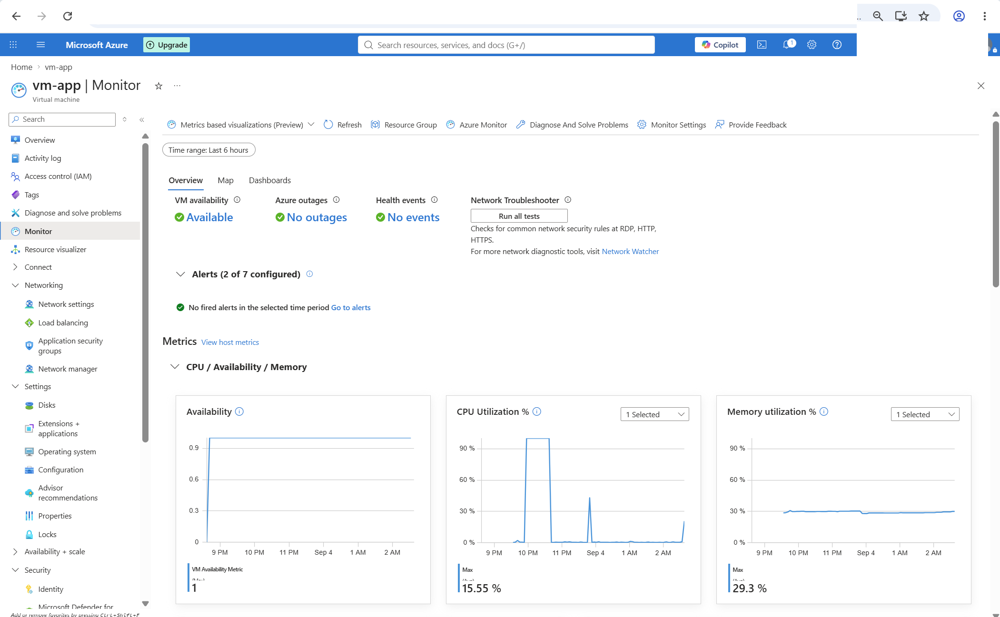
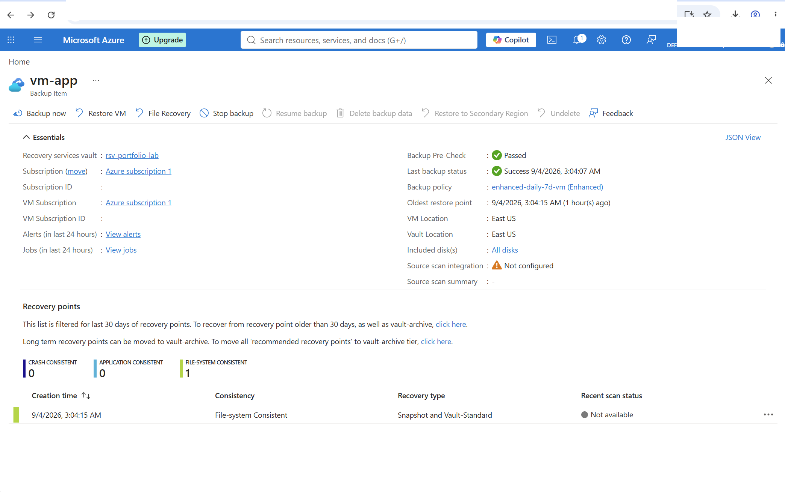
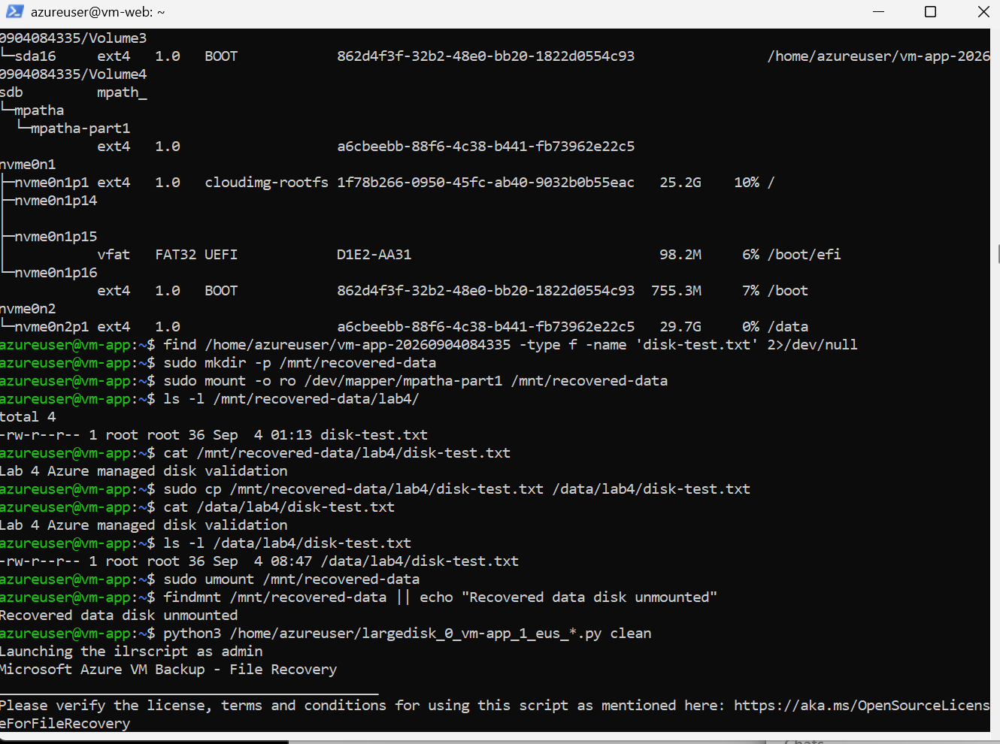

# Azure VM Operations, Monitoring & Recovery

This lab focused on operating an existing Azure Linux VM after deployment rather than simply creating another VM.

I worked through managed disk configuration, persistent Linux storage, Azure Monitor guest telemetry, alerting, explicit outbound connectivity, Azure Backup, file-level recovery, Bicep, and cost cleanup.

One of the most useful parts of this lab was troubleshooting a monitoring issue where Azure's platform CPU metric did not match what the Linux guest was actually experiencing.

---

## Architecture

```text
                        Azure Monitor
                             |
                 Azure Monitor Agent / OTel
                             |
                             v
Internet <-- NAT Gateway <-- snet-app
                             |
                          vm-app
                             |
                  +----------+----------+
                  |                     |
              OS Disk              Data Disk
                                   /data
                                     |
                                     v
                           Azure Backup
                                     |
                          Recovery Services
                               Vault
```

`vm-app` remained a private VM with no directly assigned public IP. A NAT Gateway was temporarily associated with `snet-app` to provide explicit outbound connectivity required during monitoring and package operations.

---

## Resources Used

| Resource | Purpose |
|---|---|
| `vm-app` | Ubuntu application VM used for the operations tests |
| `vm-app-data01` | 32 GiB Standard SSD managed data disk |
| `snet-app` | Private application subnet |
| `nsg-app` | Network security group for the application subnet |
| `natgw-portfolio-app` | Temporary explicit outbound connectivity |
| `nat-pip` | Public IP used by the NAT Gateway |
| `msvmi-eastus-vm-app` | Data Collection Rule for guest telemetry |
| `defaultazuremonitorworkspace-eus` | Azure Monitor workspace |
| `VMI-ActionGroup-vm-app` | Alert notification action group |
| `rsv-portfolio-lab` | Recovery Services vault |
| `enhanced-daily-7d-vm` | Enhanced VM backup policy |

---

## 1. Managed Data Disk

I attached a separate 32 GiB Standard SSD to `vm-app` instead of storing application data only on the operating system disk.

The disk was configured with:

- Standard SSD LRS
- 32 GiB capacity
- LUN 0
- ReadOnly host caching
- Platform-managed encryption

Inside Ubuntu, I created a GPT partition and formatted it with `ext4`.

The filesystem was mounted at:

```text
/data
```

I used the filesystem UUID in `/etc/fstab` with the `nofail` option so the mount would persist across reboots without making the VM dependent on the disk during startup.

After rebooting the VM, `lsblk` and `df` confirmed that the data disk mounted automatically.



This was a useful reminder that attaching a disk in Azure is only part of the job. The operating system still needs partitioning, formatting, mounting, and persistence configuration.

---

## 2. Azure Monitor Guest Metrics

I enabled detailed monitoring for `vm-app` using Azure Monitor Agent and the newer OpenTelemetry-based monitoring path.

The configuration included:

- Azure Monitor Linux Agent
- Data Collection Rule
- Azure Monitor workspace
- CPU metrics
- Disk metrics
- Filesystem metrics
- Memory metrics
- Network metrics
- System metrics

I initially selected per-process metrics as well, but removed them after reviewing the additional monitoring cost. They were not necessary for the purpose of this lab.

### Outbound Connectivity Problem

The Azure Monitor Agent was installed and running, but detailed guest metrics were not appearing.

DNS resolution worked, but HTTPS tests from `vm-app` showed that the private subnet did not have usable explicit outbound Internet connectivity.

Instead of assigning a public IP directly to `vm-app`, I added a NAT Gateway to `snet-app`.

After the NAT Gateway was associated with the subnet, HTTPS connectivity to Azure endpoints worked.

Further troubleshooting showed that the OpenTelemetry collector and MetricsExtension were running and publishing metrics successfully.

Guest telemetry then appeared in Azure Monitor.



---

## 3. Alerting and CPU Metric Troubleshooting

I configured two VM alerts:

- VM availability alert
- Percentage CPU greater than 80%

The CPU alert used:

```text
Severity: 2 - Warning
Threshold: > 80%
Aggregation: Average
Window: 5 minutes
Evaluation: Every 5 minutes
```

I generated CPU load inside the Linux VM using:

```bash
yes > /dev/null &
```

Linux `top` showed the process consuming the CPU, but the Azure platform `Percentage CPU` metric remained below 1% and the alert did not trigger.

Instead of lowering the alert threshold just to produce a successful alert, I validated the workload from multiple sources.

Using:

```bash
mpstat 1 10
```

the VM showed 100% CPU utilization with 0% idle time during the test.

Azure Monitor's OpenTelemetry guest CPU metric also captured the workload near 100%.

The comparison was:

```text
Linux top           -> ~100% CPU
Linux mpstat        -> 100% CPU
OTel guest metric   -> ~100% CPU
Azure platform CPU  -> <1%
```

This isolated the issue to the platform CPU metric for this VM rather than the Linux workload or guest monitoring pipeline.

I reviewed the custom `system.cpu.time` metric as another alerting option, but it required a PromQL-based calculation. I decided not to turn this operations lab into a PromQL project just to force an alert to fire.

This became one of the more useful troubleshooting exercises in the lab because the goal changed from "make the alert green" to understanding which telemetry source was telling the truth.

---

## 4. Azure Backup

I protected `vm-app` with an Azure Recovery Services vault.

The Enhanced backup policy was configured with:

- Daily backup
- 8:00 AM Eastern Time
- 7-day daily retention
- 1-day instant restore snapshot
- Application or file-system consistent backup
- OS disk included
- `vm-app-data01` included
- Future disks included

Enhanced policy was used because the VM uses Trusted Launch.

I manually started the initial backup and confirmed that the backup job completed successfully.

The resulting recovery point was:

```text
File-system Consistent
Snapshot and Vault-Standard
```



---

## 5. File-Level Recovery Test

I wanted to test recovery rather than stop after seeing a successful backup status.

A test file existed on the managed data disk:

```text
/data/lab4/disk-test.txt
```

with the content:

```text
Lab 4 Azure managed disk validation
```

I deleted the file from the live VM and confirmed that it no longer existed.

I then used Azure Backup File Recovery to connect the recovery point to `vm-app`.

The recovery session exposed the backed-up disks to the VM. The recovered data disk appeared through Linux multipath and had the same filesystem UUID as the original data disk.

I mounted the recovered filesystem read-only:

```bash
sudo mkdir -p /mnt/recovered-data
sudo mount -o ro /dev/mapper/mpatha-part1 /mnt/recovered-data
```

The deleted file was available in the recovery point.

I copied it back to the live data disk and validated its contents.



The recovery workflow was:

```text
Create backup
     |
Delete test file
     |
Connect recovery point
     |
Identify recovered data disk
     |
Mount recovered filesystem read-only
     |
Locate deleted file
     |
Restore file to /data
     |
Validate restored content
```

After recovery, I unmounted the recovered filesystem, disconnected the recovery disks in Azure, and removed the temporary recovery script.

No recovery password or temporary recovery connection information was stored in the repository.

---

## 6. Infrastructure as Code

I represented the main Lab 4 infrastructure changes using Bicep.

The template includes:

- Standard SSD managed data disk
- StandardV2 public IP
- StandardV2 NAT Gateway
- Existing VNet reference
- Existing NSG reference
- `snet-app` configuration
- NAT Gateway subnet association
- Existing Key Vault service endpoint configuration

The existing VM itself was not redeclared just to represent the disk attachment.

Managing `storageProfile.dataDisks` declaratively would require managing the VM resource definition as well. For this lab, I chose not to risk modifying an existing VM solely for portfolio representation.

Before deployment I used:

```powershell
az deployment group what-if
```

The first what-if exposed differences between the template and the existing Azure resources, including the public IP SKU and existing subnet properties.

I corrected the template before deployment.

The final deployment completed successfully:

```text
lab4-operations-bicep
ProvisioningState: Succeeded
```

A final what-if showed the managed disk, public IP, and subnet with no changes. Azure continued to report two NAT Gateway server/default properties that were not exposed by the Bicep type definition being used.

Bicep source:

```text
bicep/main.bicep
```

---

## Security Decisions

Several decisions were intentional:

- `vm-app` kept its private-only network design.
- No public IP was added directly to `vm-app`.
- NAT Gateway was used for explicit outbound connectivity.
- SSH keys were used instead of passwords.
- SSH agent forwarding was used through the existing jump VM.
- No private SSH key was copied onto an Azure VM.
- Recovered backup data was mounted read-only before restoration.
- Recovery passwords and temporary recovery connection information were not stored.
- Platform-managed encryption was used for the managed disk.
- Trusted Launch, Secure Boot, and vTPM remained enabled on `vm-app`.

---

## Cost Review and Cleanup

I did not leave temporary resources running after testing.

At the end of the lab:

- `vm-app` was deallocated.
- `vm-web` was deallocated.
- NAT Gateway was detached from `snet-app`.
- `natgw-portfolio-app` was deleted.
- `nat-pip` was deleted.
- VM backup protection was stopped.
- Backup data deletion was requested and completed.
- Recovery Services soft delete remained enabled.
- The remaining deleted backup data entered the vault's 14-day soft-delete lifecycle.

I intentionally kept soft delete enabled instead of weakening the Recovery Services vault configuration just to remove the recovery point immediately.

The Bicep template remains in the repository so the temporary networking resources can be recreated when needed.

---

## What I Learned

The main lesson from this lab was that VM operations involve much more than whether a VM is running.

I worked through storage persistence, monitoring agents, outbound networking, telemetry validation, alerts, backup consistency, actual file recovery, infrastructure-as-code safety, and cleanup.

The CPU monitoring problem was especially useful. Three guest-level sources showed the workload reaching 100% while the Azure platform metric remained below 1%. Instead of changing the threshold until the alert fired, I traced the monitoring path and documented the discrepancy.

The recovery test was also important because a successful backup job does not prove that data can actually be restored. Deleting a file and recovering it from the backed-up data disk gave me a much better understanding of the full recovery process.

---

## Repository Structure

```text
azure-vm-operations-monitoring-recovery/
├── bicep/
│   └── main.bicep
├── screenshots/
│   ├── 01-persistent-data-disk-validation.png
│   ├── 02-azure-monitor-guest-metrics.png
│   ├── 03-backup-recovery-point.png
│   └── 04-file-recovery-validation.png
└── README.md
```
