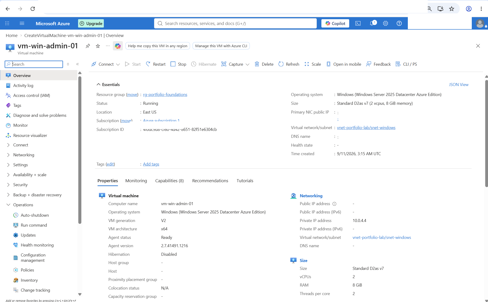
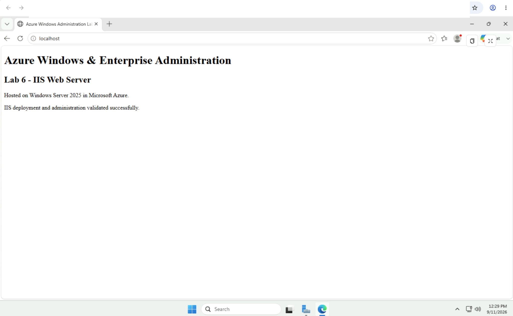
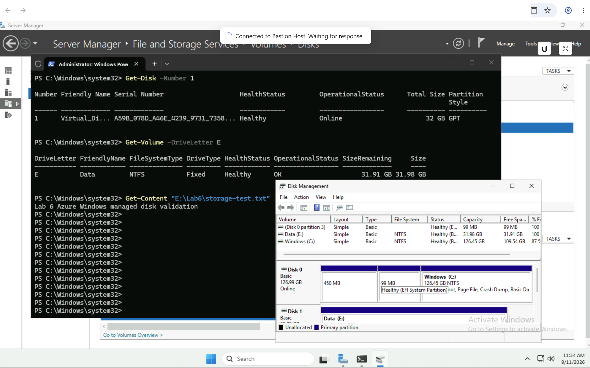
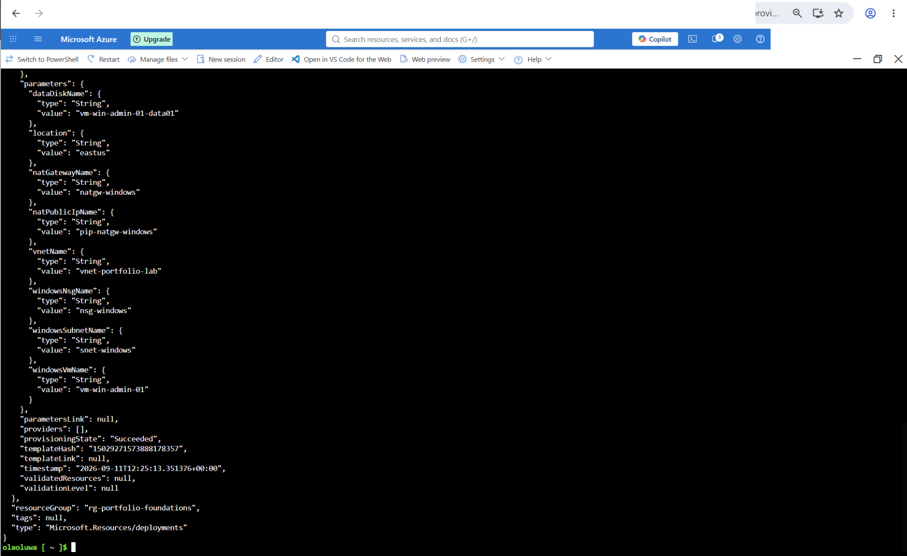

# Azure Windows & Enterprise Administration

## Overview

This project demonstrates practical Windows Server administration in Microsoft Azure, with an emphasis on secure access, networking, PowerShell administration, IIS, storage, troubleshooting, infrastructure as code, and cost-aware cloud operations.

The Windows Server VM was deployed without a public IP and administered through Azure Bastion. Outbound Internet connectivity was provided explicitly through Azure NAT Gateway only when required for Windows Update, package/service connectivity, and Windows activation.

The lab also included Windows service administration, Windows Defender Firewall inspection, IIS deployment, managed disk configuration, Event Viewer troubleshooting, system monitoring, Azure KMS activation troubleshooting, and Bicep representation of the Azure infrastructure.

---

## Architecture

```text
Administrator
     |
     | HTTPS / Azure Portal
     v
Azure Bastion
     |
     | Private RDP
     v
vm-win-admin-01
Windows Server 2025
10.0.4.4
     |
     +--------------------+
     |                    |
     v                    v
Managed Data Disk      IIS Web Server
32 GiB / NTFS / E:     TCP 80
     |
     v
snet-windows
10.0.4.0/24
     |
     +---- nsg-windows
     |
     +---- NAT Gateway
           |
           v
     Explicit outbound
     connectivity
```

The Bastion host and NAT Gateway were temporary operational resources and were removed after validation to reduce ongoing Azure cost.

---

## Azure Resources

| Resource | Configuration |
|---|---|
| Resource Group | `rg-portfolio-foundations` |
| Region | East US |
| Virtual Network | `vnet-portfolio-lab` |
| Windows Subnet | `snet-windows` — `10.0.4.0/24` |
| Network Security Group | `nsg-windows` |
| Windows VM | `vm-win-admin-01` |
| Operating System | Windows Server 2025 Datacenter: Azure Edition |
| VM Security | Trusted Launch, Secure Boot, vTPM |
| VM Public IP | None |
| Administration | Azure Bastion |
| Outbound Connectivity | Azure NAT Gateway during lab operations |
| Data Disk | 32 GiB Standard SSD |
| Web Server | IIS |
| Infrastructure as Code | Bicep |

---

## Secure Windows Administration

The Windows Server VM was intentionally deployed without a public IP address.

Remote administration was performed through Azure Bastion instead of exposing RDP directly to the Internet. The VM remained reachable through its private address inside the Azure virtual network.

The Windows subnet also used a subnet-level Network Security Group rather than attaching another NSG directly to the VM NIC.

This kept the access model simple:

```text
Internet
   X
Direct RDP to VM

Administrator
   |
Azure Bastion
   |
Private RDP
   |
Windows Server
```

One issue occurred during the Bastion deployment. Azure initially reported that `AzureBastionSubnet` could not be found. I verified the subnet configuration directly in the virtual network and, during the retry, noticed that the Portal had changed the selected VNet to a newly proposed VNet. I corrected it back to `vnet-portfolio-lab` before deploying again.

The Bastion deployment then completed successfully.

### Evidence



---

## Windows Networking and Explicit Outbound Connectivity

The Windows VM received:

```text
IPv4 Address: 10.0.4.4
Subnet:       10.0.4.0/24
Gateway:      10.0.4.1
```

The subnet was configured without default outbound access.

Initial testing showed that DNS resolution worked, but outbound HTTPS connectivity failed:

```powershell
Test-NetConnection www.microsoft.com -Port 443
```

Initial result:

```text
TcpTestSucceeded : False
```

This helped isolate the problem: the VM had working Azure networking and DNS but did not have an explicit outbound Internet path.

I deployed a StandardV2 NAT Gateway and associated it only with `snet-windows`.

After the change:

```powershell
Test-NetConnection www.microsoft.com -Port 443
```

returned:

```text
TcpTestSucceeded : True
```

Windows Update also became reachable and reported that the server was up to date.

This reinforced the difference between private VNet connectivity, DNS resolution, and explicit Internet egress.

---

## PowerShell and Windows Services

PowerShell was used throughout the lab for administration and validation.

Important Windows services were inspected:

```powershell
Get-Service W32Time, WinRM, TermService
```

The services included:

- `W32Time` — Windows Time
- `WinRM` — Windows Remote Management
- `TermService` — Remote Desktop Services

Startup behavior was also inspected using CIM:

```powershell
Get-CimInstance Win32_Service |
Where-Object {$_.Name -in "W32Time","WinRM","TermService"} |
Select-Object Name, State, StartMode
```

`W32Time` was used for a safe service-management exercise:

```powershell
Get-Service W32Time
Restart-Service W32Time
Get-Service W32Time
```

The service was verified as running after the restart.

This followed a simple operational pattern:

```text
Inspect → Change → Validate
```

---

## IIS Web Server Administration

IIS was installed using PowerShell:

```powershell
Install-WindowsFeature Web-Server -IncludeManagementTools
```

The IIS service was validated:

```powershell
Get-Service W3SVC
```

Local HTTP connectivity was then tested:

```powershell
Invoke-WebRequest http://localhost -UseBasicParsing |
Select-Object StatusCode, StatusDescription
```

Result:

```text
200 OK
```

The site was also reachable through the VM's private IP.

The default IIS page was backed up, and the web root was replaced with a custom Lab 6 validation page.

The final page confirmed that IIS was running successfully on Windows Server 2025 in Azure.

### Evidence



---

## Network Security: NSG and Windows Defender Firewall

Security was validated at both the Azure and operating-system layers.

The Windows Defender Firewall profiles remained enabled.

The IIS HTTP rule was inspected with PowerShell:

```powershell
Get-NetFirewallRule -DisplayName "World Wide Web Services (HTTP Traffic-In)" |
Get-NetFirewallPortFilter |
Select-Object Protocol, LocalPort, RemotePort
```

The rule permitted:

```text
Protocol:  TCP
LocalPort: 80
```

At the Azure layer, `nsg-windows` already allowed VNet-to-VNet traffic through the default `AllowVnetInBound` rule.

A separate custom TCP 80 NSG rule was therefore not added.

Instead of adding a rule simply because IIS used port 80, I verified the existing traffic path first and kept the configuration unchanged when the existing rule already satisfied the requirement.

IIS was then tested from another VM inside the VNet:

```bash
curl -I http://10.0.4.4
```

The response included:

```text
HTTP/1.1 200 OK
Server: Microsoft-IIS/10.0
```

This validated the complete path:

```text
Linux VM
   ↓
Azure VNet
   ↓
NSG
   ↓
Windows Defender Firewall
   ↓
IIS
```

---

## Windows Managed Disk Administration

A 32 GiB Standard SSD managed disk was attached to the Windows VM at LUN 0.

Windows initially detected the disk as:

```text
Online
Healthy
RAW
32 GiB
```

The disk was initialized using GPT:

```powershell
Initialize-Disk -Number 1 -PartitionStyle GPT
```

A partition was created and assigned drive letter `E:`:

```powershell
New-Partition -DiskNumber 1 -UseMaximumSize -DriveLetter E
```

The volume was formatted as NTFS:

```powershell
Format-Volume `
  -DriveLetter E `
  -FileSystem NTFS `
  -NewFileSystemLabel "Data" `
  -Confirm:$false
```

A validation directory and file were then created:

```powershell
New-Item -Path "E:\Lab6" -ItemType Directory

"Lab 6 Azure Windows managed disk validation" |
Set-Content "E:\Lab6\storage-test.txt"

Get-Content "E:\Lab6\storage-test.txt"
```

This validated the full workflow from Azure managed disk attachment through Windows disk initialization, partitioning, formatting, and data access.

### Evidence



---

## Event Viewer and Troubleshooting

Windows System logs were reviewed using Event Viewer and PowerShell.

Rather than treating every warning or error as an active failure, I compared historical events with the VM's current state before making configuration changes.

### Time-Service Warning

A Windows Time Service warning showed that `time.windows.com` had previously been unreachable.

The timestamp matched the period before the NAT Gateway was configured.

Current time synchronization was checked with:

```powershell
w32tm /query /status
```

The system reported a successful recent synchronization.

The configured peer was also inspected:

```powershell
w32tm /query /peers
```

No newer Time-Service warnings appeared after outbound connectivity was restored.

This connected the historical Windows warning to the earlier networking condition rather than treating it as a separate unresolved problem.

### Hyper-V Network Event

A Hyper-V NetVSC Event ID 51 was also investigated.

Current network adapters were checked:

```powershell
Get-NetAdapter |
Format-Table Name, InterfaceDescription, Status, LinkSpeed
```

Both Azure/Hyper-V network adapters were operational.

The Event 51 records occurred at the same startup timestamp and did not continue afterward.

Because current networking was healthy, I did not make an unnecessary configuration change solely because Event Viewer contained an error-level historical event.

---

## Windows Performance Monitoring

Basic operating-system monitoring was performed using PowerShell and Task Manager.

Memory and boot information were retrieved with CIM:

```powershell
Get-CimInstance Win32_OperatingSystem |
Select-Object `
    @{Name="TotalMemoryGB";Expression={[math]::Round($_.TotalVisibleMemorySize/1MB,2)}},
    @{Name="FreeMemoryGB";Expression={[math]::Round($_.FreePhysicalMemory/1MB,2)}},
    LastBootUpTime
```

Live CPU utilization was checked with:

```powershell
Get-Counter '\Processor(_Total)\% Processor Time'
```

Available memory was checked with:

```powershell
Get-Counter '\Memory\Available MBytes'
```

Task Manager was also used to validate CPU and memory state visually.

The VM showed no significant CPU or memory pressure during validation.

Detailed Azure Monitor configuration was intentionally not repeated here because deeper Azure VM monitoring had already been implemented in a previous project.

---

## Windows Activation and Azure KMS Troubleshooting

Windows Server initially entered Notification mode even after general Internet connectivity had been restored.

Licensing inspection showed that the server was using the volume KMS client channel.

Instead of changing the product key or weakening firewall rules, I tested connectivity to the Azure KMS endpoint first:

```powershell
Test-NetConnection azkms.core.windows.net -Port 1688
```

The test succeeded.

Activation was then retried:

```powershell
slmgr /ato
```

Windows reported that the product activated successfully.

The final licensing state was verified with PowerShell:

```powershell
Get-CimInstance SoftwareLicensingProduct |
Where-Object {
    $_.Name -like "Windows*" -and
    $_.PartialProductKey
} |
Select-Object Name, Description, LicenseStatus
```

Final result:

```text
LicenseStatus = 1
```

This confirmed that Windows was licensed.

The troubleshooting sequence was:

```text
Notification mode
      ↓
Verify KMS client configuration
      ↓
Test Azure KMS TCP 1688
      ↓
Connectivity succeeds
      ↓
Retry activation
      ↓
Verify LicenseStatus = 1
```

---

## Infrastructure as Code with Bicep

The Lab 6 Azure architecture was represented using Bicep.

Because the infrastructure had already been deployed and validated manually, the Bicep template uses `existing` resource references for the live resources rather than attempting to recreate or mutate them.

The template references:

- existing VNet
- Windows subnet
- Network Security Group
- NAT Gateway
- NAT public IP
- Windows Server VM
- managed data disk

Before deployment, Azure What-If was used:

```bash
az deployment group what-if \
  --resource-group rg-portfolio-foundations \
  --template-file main.bicep
```

The result showed no create, modify, or delete operations against the working environment.

The Bicep deployment was then executed:

```bash
az deployment group create \
  --resource-group rg-portfolio-foundations \
  --name lab6-windows-bicep \
  --template-file main.bicep
```

The deployment completed successfully.

This approach allowed the completed architecture to be represented as code without introducing unnecessary risk to working or shared portfolio resources.

### Evidence



### Bicep

[`bicep/main.bicep`](bicep/main.bicep)

---

## Cost-Aware Cleanup

Several resources were required only while the lab was actively being built and tested.

After validation:

- Azure Bastion Standard was deleted.
- The Bastion public IP was deleted.
- The NAT Gateway was detached from `snet-windows` and deleted.
- The NAT Gateway public IP was deleted.
- `vm-win-admin-01` was stopped and deallocated.
- The dedicated Windows subnet and NSG were retained.
- The Azure Bastion subnet was retained without a deployed Bastion host.

The Windows subnet therefore no longer has the temporary explicit NAT outbound path used during the lab.

This cleanup preserves the project architecture and evidence while reducing unnecessary ongoing Azure charges.

---

## Key Troubleshooting Lessons

This project included several real operational issues rather than only a successful deployment path.

### 1. Bastion deployment dependency

```text
Bastion deployment failed
        ↓
AzureBastionSubnet reference unavailable
        ↓
Verify subnet directly in VNet
        ↓
Catch Portal selecting a new VNet during retry
        ↓
Correct existing VNet
        ↓
Deployment succeeds
```

### 2. Private VM outbound connectivity

```text
Private IP works
DNS works
TCP 443 fails
        ↓
No explicit outbound path
        ↓
Deploy NAT Gateway
        ↓
TCP 443 succeeds
        ↓
Windows Update reachable
```

### 3. Historical Windows events

```text
Warning/Error found
        ↓
Check timestamp
        ↓
Compare with current system state
        ↓
Validate service/network health
        ↓
Change configuration only when justified
```

### 4. Windows activation

```text
Notification mode
        ↓
Verify KMS configuration
        ↓
Test Azure KMS connectivity
        ↓
Retry activation
        ↓
LicenseStatus = 1
```

These exercises reinforced an important operational principle: an error message is evidence to investigate, not automatically a reason to change configuration.

---

## Skills Demonstrated

- Azure Windows Server deployment
- Secure private VM administration
- Azure Bastion
- Azure virtual networking
- Explicit outbound connectivity with NAT Gateway
- Network Security Groups
- PowerShell administration
- Windows Services
- Windows Defender Firewall
- IIS deployment and administration
- Windows managed disks
- GPT partitioning and NTFS
- Event Viewer
- Windows troubleshooting
- Performance monitoring
- Azure KMS activation troubleshooting
- Bicep
- Azure What-If
- Infrastructure validation
- Cost-aware Azure resource cleanup

---

## What I Learned

This project helped connect Windows administration with the Azure infrastructure underneath it.

The biggest lesson was that administering a Windows Server in Azure is not only about working inside Windows. VM access, subnet design, outbound connectivity, NSGs, operating-system firewall rules, storage, licensing, and Azure resource lifecycle all affect whether the workload operates correctly.

I also got more practice validating the current state before making changes. That was useful during the Event Viewer investigation, the NAT Gateway troubleshooting, and the Windows activation issue.

The final environment provided hands-on experience administering a private Windows Server workload while keeping security, troubleshooting, infrastructure as code, and cloud cost in view.
